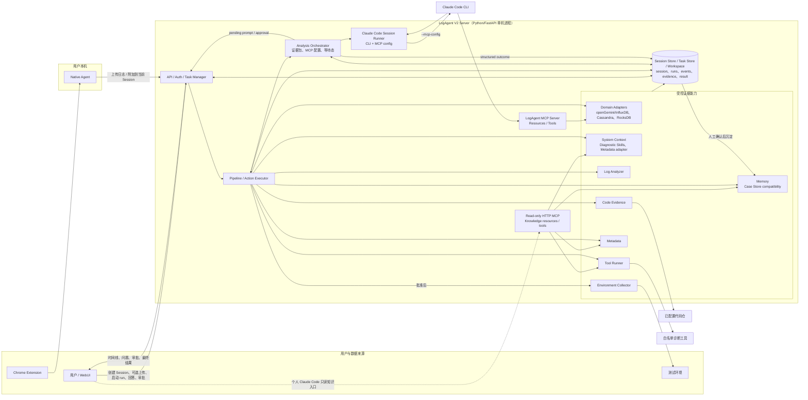

# LogAgent MVP 总览

当前权威文档入口是本总览、[SPEC.md](./SPEC.md)、各可运行组件目录，以及 [docs/modules](./docs/modules/README.md) 中的 Server 内部能力文档。

## 目标

LogAgent 是面向开发和运维诊断的证据工作台，也是 Claude Code 的领域诊断增强层。主入口是团队共享 Server 的 WebUI `Analyze`，用户通过浏览器完成日志、流水线和问题分析；高级入口是只读 HTTP MCP，个人本地 Claude Code 可连接共享 Server 读取 Skills、Metadata、Case、工具目录和领域能力摘要，用于纯本地分析。

LogAgent 不接管个人本地 Claude Code 环境。Server 只提供受保护的只读 MCP endpoint、Skills 全量 zip、Tools 二进制快照 zip 和配置示例；本地 Claude Code 的安装、注册、API Key header 注入和工具包引用由个人环境处理。

当前重点场景是快速问题分析、日志分析、日常测试流水线失败分析和数据库/存储系统专项诊断。第一批领域继续覆盖 openGemini/InfluxDB，并新增 Cassandra、RocksDB 的 Domain Adapter 骨架。

## 技术选型原则

能用 Rust 实现的模块优先使用 Rust。整体语言优先级：

```text
Rust -> C/C++ -> Go/Python/Java 等
```

默认建议：

- 本地 Agent、服务端 API、日志分析器、工具调度器、代码证据、环境采集优先使用 Rust。
- 已有 C/C++ 工具可直接复用，通过 Tool Runner 统一调用。
- Python/Go/Java 主要作为已有生态或历史工具的兼容选项，不作为新模块首选。

V2 重构分支 `rewrite/logagent-v2` 是一个明确例外：为评估小团队内部使用的主流 Agent 技术栈，新增 `server-v2/` clean-room Python 实现。V2 首版采用 FastAPI、LangGraph-oriented Agent runtime、SQLite WAL、本地 artifact store 和 DB-backed job queue，不引入 PostgreSQL 或 Redis，也不要求完全兼容 legacy V1 API。V2 Agent runtime 已按 V1 默认值实现轮次、LLM 调用、动作、重复工具 fingerprint、总 token、单次运行时间、用户追问和审批预算终止；预算耗尽会生成带 `budgetLimited=true` 的低置信度结果，而不是把任务标记为系统失败。

核心链路：

```text
日志来源
  - 浏览器下载 / 手动上传
  - 测试环境 SSH/SCP 采集
    |
    v
基础证据提取
  - rg 日志检索
  - Skill-backed System Context 背景资源
  - 实例和集群元数据
  - 外部工具调用
  - 对应版本代码检索
  - 环境状态采集
    |
    v
Analysis Orchestrator
  - 汇总任务证据、领域上下文和预算
  - 生成 Claude MCP 配置
  - 启动或恢复 Claude Code session
    |
    v
Claude Code session
  - 通过 LogAgent MCP resources/tools 获取证据
  - 按权限模式使用允许的 native tools
  - 返回结构化 session outcome
    |
    v
人工确认
    |
    v
Case 沉淀与召回
```

## 规划架构图



关键控制边界：

- Analysis Orchestrator、LLM Gateway 和 Claude Code 都不能绕过 LogAgent MCP/Server 边界直接执行领域工具、读取任意任务外路径或连接 SSH。
- Server Action Executor 是唯一执行入口，负责 schema、白名单、预算、幂等和审批检查。
- 日志搜索、白名单工具和只读代码检索可自动执行；环境 SSH/SCP 采集默认等待用户批准。
- `LOGAGENT_CLAUDE_CODE_PATH` 是默认 Claude Code CLI 路径来源。Log Analysis run 会写出 `analysis_package.json`、`claude_prompt.md`、`claude_mcp_config.json`、`claude_session.json`、`mcp_calls.jsonl` 和 Claude session 语义的 `agent_response.json`。Claude CLI 只接收短 stdin 启动 prompt，证据包通过任务专属 MCP `analysis_package` resource 读取，避免大 prompt 进入 argv 或 stdin；完整 `metadata_context.json` 不进入该 package，Claude 初始只看到 `metadataContextOutline`，需要细节时通过 `logagent.query_metadata` 按 section/filter/分页读取。未配置或调用失败时任务失败，不自动 fallback。
- Log Analysis 公开入口是可恢复的 Session；每次分析 run 仍创建一个 Server task workspace 快照。用户可从 WebUI 删除非运行中的 Session 以清理历史列表，删除只移除 Session 记录和 Session timeline，不级联删除上传、task workspace 或结果产物。
- WebUI 主入口显示为 `Analyze`，仍使用 Session-first 分析能力，并继续默认调用 Server 机器上的 Claude Code、任务专属 stdio MCP 和 Server 本地 workspace。
- 个人高级入口是 `POST /api/mcp/readonly`，只读返回 Skills、Metadata、Case、Tools catalog 和 Domain Adapter 等共享知识；不读取/启动/恢复 Session，不上传文件，不审批，不运行远程工具，不写入 Server 数据。
- Fetch endpoint 只在 `fetch.enabled=true` 且配置 allowlist 和 32-byte base64 secret key 后可用。Server 从 DevTools bash cURL 导入 endpoint，Authorization、Cookie、token/api_key 类 query/body 字段进入加密 credential set；WebUI、API、日志和 artifact 只展示脱敏值。V2 endpoint summary 使用 `schemaVersion=2`，并显式记录 `refreshPolicy.mode=manual_only`，当前不做自动 token refresh。任务 MCP 可调用 `logagent.fetch`，只读 HTTP MCP 不开放 fetch 执行；V2 task MCP Fetch 使用稳定 `act_fetch_<digest>` 引用并返回 Rust/V1 顶层状态字段，Fetch result 使用 Rust/V1 `schemaVersion=3` tool result envelope，并保留 V2 response-body artifact id/path 扩展。
- Log Analyzer 会自动识别节点日志包 `<packageId>_<instanceId>_<nodeId>_<yyyy_MM_dd_HH_mm_ss_micros>_logs.tar.gz`，按 `extracted/<nodeId>/<timestamp>/{tsdb,stream,agent}/` 展开三类日志目录；archive 内允许存在顶层包装目录和 `./` 等目录项，只要文件路径中包含 `var/chroot/gemini/log/{tsdb,stream}` 或 `home/Ruby/log` 即可归类。manifest 会记录 V1 样式 upload/package 摘要、log group 文件数、gzip 压缩统计、ignored path 样例和 file-level package metadata。轮转 gzip 透明读取，并生成 `tool_inputs/index.json`、通用 `log_text` JSONL 和 analyzer-ready 输入；只有匹配当前 `toolIds` 的 materialized input 会被对应工具作为独占自动输入消费。
- 普通文本上传和普通 archive 上传会使用稳定 `extracted/<uploadDir>/...` 逻辑路径；同名上传使用 `_2` 等后缀去重，避免 manifest、grep、log slice 和 Tool Runner fallback 在多上传场景中指向歧义文件。
- 初始 `grep_results.json` 使用配置化关键词，V2 默认与 Rust/V1 对齐为 `error,exception,timeout,fail,failed,panic,fatal,refused,denied,verify`，不再自动把用户问题拆词混入初始扫描；需要追加关键词时通过 `logagent.search_logs` 后续检索。
- 任务 MCP `logagent.search_logs` 不覆盖初始 `grep_results.json`；每次后续搜索写入稳定 `log_searches/logsearch_*.json`，返回命中行正文、按关键词计数、未命中关键词和 `log_searches/...#matches/<index>` evidence ref。`logagent.get_log_slice` 使用稳定 `log_slices/slice_<digest>.json#lines` 引用。Claude Code prompt 要求检查命中行正文，不能只按 `totalMatches` 推断异常类型或技术栈。
- `logagent.huawei_cloud_package_sync` 是默认关闭的内置手动工具；启用后只接受一个已上传包，把包流式 PUT 到配置的 Huawei OBS，再执行用户提交的 GaussDB update/query SQL，并把 OBS HEAD 与查询摘要写入 `tool_results/<action_id>/result.json`。OBS/GaussDB 密钥只从环境变量读取，不进入 artifact。
- Settings 提供只读 MCP URL、Authorization header 提示、Claude Code HTTP MCP 配置示例，以及 `skills.zip` / `tools.zip` 下载入口。
- Session 可以只包含用户问题而不包含上传日志；这种 run 会生成 `session_text_input.json`、空 raw/input 快照、空 manifest 文件列表和空 grep evidence，再由 Analysis Orchestrator 基于问题、Metadata、Case 和后续交互继续分析。
- `WAITING_FOR_USER` 支持用户提交补充信息，也支持声明没有更多信息并请求基于当前证据直接生成最终结果；该意图会写入 `analysis_state.json` 并通过 `analysis_package.json` 约束下一轮 Claude Code 不再继续追问。
- Log Analysis run 会固化 `system_context.json`，把已选择或自动匹配的 Diagnostic Skills 和 Metadata adapter 摘要作为背景参考带入 Prompt；System Context 和 Skill reference 不能替代当前任务证据。
- 成功的 Log Analysis run 会在最终结果生成后静默调用 LLM Gateway 生成短 alias，用于 WebUI 展示；该命名调用不写入 Session timeline 或 analysis events。
- 所有 Session、任务上下文、事件、证据和结果都持久化到 Session Store / Task Store / Workspace，支持重启恢复。
- WebUI 可实时展示 Task execution、Claude Code session、MCP calls 和 evidence artifact；LLM response content 日志只能通过顶部 debug 开关手动开启。
- Memory 当前只激活 `memoryType=case`，通过兼容的 Case API 接收人工确认后的 Case，包括成功任务最终结果确认和用户通过 LLM-assisted 文本导入确认的手工 Case。

## 项目目录

根目录只保留当前真实可运行的组件和工程支撑目录。日志分析、Metadata、Tool Runner、Analysis Orchestrator、Claude Code Session Runner、LogAgent MCP、Domain Adapters、LLM Gateway、Memory/Case Store 等能力目前都由 `server-v2/` 的 Python/FastAPI 进程承载；旧 Rust `server/` crate 已从 V2 分支移除。

| 目录 | 职责 | Spec |
|------|------|------|
| [chrome-extension](./chrome-extension/README.md) | Chrome 插件，识别下载并触发上传 | [SPEC](./chrome-extension/SPEC.md) |
| [native-agent](./native-agent/README.md) | 本地 Rust Agent，接收插件请求并默认上传到 V2 Server | [SPEC](./native-agent/SPEC.md) |
| [server-v2](./server-v2/README.md) | V2 clean-room Python/FastAPI 小团队 Agent Server，SQLite + 本地 artifact store | [SPEC](./server-v2/SPEC.md) |
| [webui](./webui/README.md) | Vite WebUI、Analyze、任务证据、Memory、Skill-backed System Context、Metadata、Tools 和 Settings 可视化 | [SPEC](./webui/SPEC.md) |
| [deploy](./deploy/README.md) | Runtime 部署模板、环境变量示例、服务控制和重建安装脚本 | [Deployment SPEC](./docs/modules/deployment/SPEC.md) |
| [examples](./examples) | Native Agent V2 配置样例 | - |
| [scripts](./scripts) | V2 本地管理、WebUI 构建、源码 analyzer 构建和 smoke 脚本 | - |
| [testing](./testing/README.md) | 测试 fixture、集成测试和 mock Claude CLI | [SPEC](./testing/SPEC.md) |
| [third_party](./third_party) | 源码引用的诊断工具 submodules：InfluxQL、Flux、openGemini storage 和 InfluxDB 1.x storage analyzers | - |

Server 内部能力的设计文档已归档到 [docs/modules](./docs/modules/README.md)：

| 能力 | 文档 |
|------|------|
| Claude Code Session Runner | [README](./docs/modules/agent-backends/README.md) / [SPEC](./docs/modules/agent-backends/SPEC.md) |
| Log Analyzer | [README](./docs/modules/log-analyzer/README.md) / [SPEC](./docs/modules/log-analyzer/SPEC.md) |
| Tool Runner / Fetch / Huawei Package Sync | [README](./docs/modules/tool-runner/README.md) / [SPEC](./docs/modules/tool-runner/SPEC.md) |
| Domain Adapters | [README](./docs/modules/domain-adapters/README.md) / [SPEC](./docs/modules/domain-adapters/SPEC.md) |
| Metadata | [README](./docs/modules/metadata/README.md) / [SPEC](./docs/modules/metadata/SPEC.md) |
| Skills | [README](./docs/modules/skills/README.md) / [SPEC](./docs/modules/skills/SPEC.md) |
| System Context | [README](./docs/modules/system-context/README.md) / [SPEC](./docs/modules/system-context/SPEC.md) |
| Analysis Agent | [README](./docs/modules/analysis-agent/README.md) / [SPEC](./docs/modules/analysis-agent/SPEC.md) |
| LLM Gateway | [README](./docs/modules/llm-gateway/README.md) / [SPEC](./docs/modules/llm-gateway/SPEC.md) |
| Memory / Case Store compatibility | [README](./docs/modules/case-store/README.md) / [SPEC](./docs/modules/case-store/SPEC.md) |
| Memory | [README](./docs/modules/memory/README.md) / [SPEC](./docs/modules/memory/SPEC.md) |
| Code Evidence | [README](./docs/modules/code-evidence/README.md) / [SPEC](./docs/modules/code-evidence/SPEC.md) |
| Environment Collector | [README](./docs/modules/environment-collector/README.md) / [SPEC](./docs/modules/environment-collector/SPEC.md) |
| Config / Interfaces / Security / Deployment / Roadmap | [docs/modules](./docs/modules/README.md) |

## MVP 边界

第一版不做企业级日志平台，不引入 Elasticsearch/OpenSearch、CMDB、监控接入、通用远程运维、复杂权限体系和 Multi-Agent 编排，也不尝试替代 Codex、Claude Code 或 OpenCode。

关键边界：

- 外部工具只允许白名单配置调用。
- Fetch endpoint 默认关闭；启用后只允许访问 `fetch.allowed_hosts` 中的 `http/https` 目标，redirect 每跳重新校验，跨 host 不转发 Authorization/Cookie。
- LLM Gateway 不能直接执行任意命令。
- Claude Code 只能按 `analysisMode` permission profile 使用 native tools；领域证据和工具执行必须经过 LogAgent MCP/Server。
- Server 会在每个 Claude Code permission profile 中自动允许任务专属 LogAgent MCP 工具命名空间 `mcp__logagent__*`；`diagnose` 仍通过 `--tools ""` 禁用 native tools。用户审批只控制 LogAgent 内部 approval-gated action，不能替代 Claude CLI 的 `allowedTools` 白名单。
- 安全只读动作可自动执行，SSH/SCP 远程采集默认需要用户批准。
- 代码仓只读检索，不自动改代码。
- SSH/SCP 只访问配置中的测试环境节点。
- pgvector 不是第一版硬依赖，Case embedding 可以先用本地文件或 SQLite。
- V2 部署形态采用单一 Python/FastAPI Server 进程 + SQLite + 本地 artifact store；后续确有独立生命周期时再拆服务。
- Agent 上下文只在当前任务内持久化；跨任务知识只来自人工确认后的 Case。
- 统一配置使用 `logagent.yaml`，密钥只引用环境变量。

## 当前优先级

当前阶段优先把 LogAgent 重构为“诊断证据工作台 + Claude Code MCP 增强层 + Domain Adapter”：保留 Session-first Log Analysis、Skill-backed System Context、上传、Metadata、Tool Runner、Fetch endpoint、Tools 页面和 Case Store，V2 Agent runtime 生成证据包和 MCP 配置后启动或恢复 Claude Code session。Claude Code 通过 LogAgent MCP tools 请求日志搜索、日志切片、领域工具、受控 Fetch endpoint、按需分页 Metadata slice、Skill reference、Case recall、用户追问和审批；V2 Server 继续负责白名单、allowlist、审批、证据持久化和最终 evidence ref 校验。InfluxQL、Flux、openGemini storage 和 InfluxDB 1.x storage analyzers 已通过 `third_party/` submodules 引用，`scripts/build-tools.sh` 构建并安装到 `target/tools`、`$LOGAGENT_WORK_DIR/bin/tools` 或 runtime `bin/tools`，`scripts/smoke-source-built-analyzers.sh` 可聚合验证四个真实 analyzer smoke；InfluxDB analyzer 构建会临时把其 Flux 依赖指向本地 `third_party/flux`，确保 `pkg-config.sh` 用完整 `libflux` Rust 源码而不是 Go module cache，并在未显式设置 `GOSUMDB` 时默认关闭该临时构建的公共 checksum DB 查询。V2 已能把 Flux `metrics/topQueries/parseErrors` stdout 和 InfluxQL Report/Compare stdout 转成 summary/findings。内网环境可通过 `LOGAGENT_SUBMODULE_BASE_URL` 或各 `LOGAGENT_SUBMODULE_*_URL` 手动指定 submodule clone 地址，构建脚本会写入本地 Git submodule config 且不修改 `.gitmodules` 或顶层仓库 `origin`；只有已初始化的 submodule worktree 会同步更新其自身 `origin`。Tools 页面已接入 `pprof_analyzer` 示例工具、Fetch 子页、Huawei OBS + GaussDB package sync 内置工具和 Remote Executor 执行机纳管；Remote Executor 通过白名单 SSH 模板创建 `remote_command_run`，默认内置 smoke、系统版本、uptime/load、磁盘、内存、进程概览、端口监听，以及 openGemini、Cassandra、RocksDB 基础只读进程/目录候选，V2 审批后的 `collect_environment` 可通过单目标或 `targets[]` 批量目标执行白名单命令 / SCP 拉取有大小上限的远程文件。

V2 重构分支当前已迁移核心 Server 能力到小团队单机栈：FastAPI、SQLite WAL、本地 artifact、DB-backed jobs、日志解压/搜索、Tool Runner、Metadata（JSON/YAML/CSV/openGemini 导入）、Skills、Case Memory、Fetch、Remote Executor、Environment Collector 单目标、approved `targets[]` 批量采集和多 executor/template 唯一 hint 选型、只读 Code Evidence worktree cache / 文件级 diff、只读/任务 MCP、Claude runtime contract artifacts，以及拆分为 provider/tool/validation/result 节点的 LangGraph Agent runtime。默认 WebUI 路由也已切到 V2 Analyze、Memory、System Context、Metadata、Tools、Fetch、Executors 和 Settings。Native Agent 默认对接 V2 Session-scoped 上传接口。本地开发可用 `scripts/v2-local.sh build|start|stop|restart|status|logs|smoke-tools` 快速管理 V2 和验证源码 analyzer，runtime 部署继续使用 `deploy/rebuild-v2-install.sh` 和 `deploy/logagent-v2ctl.sh`；两套 `status` 都会在服务可达时用 API Key 查询 tools catalog 并打印 source-built analyzer 注册、可执行性和不可用原因，源码工具可用 `scripts/smoke-source-built-analyzers.sh` 做全量或单工具 smoke。V2 tools catalog 同时返回 `tools` 和兼容 alias `toolPlugins`，并在未显式配置工具目录时扫描当前工作目录和源码目录的标准 tools 路径，避免手工启动或前后端短暂不一致导致 Tool plugins 空列表。旧 Rust `server/` crate 和 V1-only 启停/部署脚本已从 V2 分支删除；后续重点是更多真实领域 fixture 和产品化验证。

Code Evidence V2 MVP 已支持通过 `LOGAGENT_V2_CODE_REPOS_JSON` 配置本地 git repo、版本到 ref 映射和 search roots，并通过 `LOGAGENT_V2_CODE_WORKTREE_ROOT` 或默认 `data_dir/code_worktrees` 创建/复用 detached worktree，在固定 commit 内执行 `logagent.search_code` 并写入 `code_evidence/<action_id>.json#matches/<index>` 最终答案证据；`LOGAGENT_V2_CODE_WORKTREE_MAX_PER_REPO` 默认按每个 product 保留 5 个 detached worktree，并在 search 后按 LRU 清理旧缓存，同时把同 product `wt_*` cache 目录中的 invalid/unregistered orphan 扫描结果记录到 `worktree.cleanup.orphanScan`。`logagent.diff_code` 已支持受控 base/target 版本或 ref 的只读 `git diff --numstat` 文件级比较，写入 `code_evidence/<action_id>.json#diffs/<index>` 证据。绑定 Metadata instance 的 run 会继承并校验该 instance 的 product/version，避免 MCP 请求绕过任务上下文；diff 的 target 继承该版本，base 可选择更早的配置版本/ref。Code Investigation 和 Fix 模式的符号级解析、patch hunk / AST diff 和代码修改仍延后到产品闭环稳定后实现；当前 WebUI 显式执行机命令已有通用 Remote Executor 框架，Analysis Agent 审批后的 `collect_environment` 已可选择 Remote Executor 白名单命令、白名单 file template，或用 approved `targets[]` 批量采集，把远程 result/stdout/stderr/collected_file 注册为环境背景证据；`analysis_package.environmentCollection` 会向 Agent 暴露启用 executor 和模板候选，单 executor 场景可自动补齐 `executorId`，多 executor 场景可用唯一 hint 匹配 `target` / `executor` / `node` / `host` 与 `template` / `command` / `file`，无匹配或歧义时拒绝远程执行；没有远程目标时仍保留兼容 mock evidence 路径。

## 开发约定

后续每开发或修改一个可运行组件，都必须同步更新该组件目录下的 `README.md` 和 `SPEC.md`；修改 V2 Server 内部能力时，同步更新 `server-v2/README.md`、`server-v2/SPEC.md`，必要时更新 `docs/modules/` 下对应能力文档。

每次修改完文件，也必须同步更新根目录 [PROGRESS.md](./PROGRESS.md)，记录项目进展、行为变化、验证结果或下一步变化。

`README.md` 至少包含：

- 当前实现状态
- 配置项
- 本地运行方式
- 部署方式
- 健康检查或验证方式
- 与上下游组件的接口约定

`SPEC.md` 至少包含：

- 目标和职责边界
- 输入输出
- API 或数据产物
- 配置和安全约束
- 验收标准

已经写好的可运行组件：

- `chrome-extension`
- `native-agent`
- `server`
- `webui`

这些组件的 README 需要随着代码变化持续维护。
