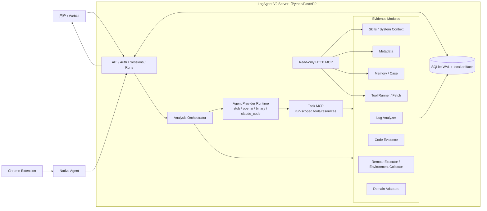

# LogAgent MVP 总览

当前权威入口是本文件、[SPEC.md](./SPEC.md)、各可运行组件目录，以及 [docs/modules](./docs/modules/README.md) 中的 V2 Server 内部能力文档。

## 目标

LogAgent 是面向开发和运维诊断的证据工作台。团队主入口是共享 Server 的 WebUI `Analyze`，用于上传日志、绑定 Metadata/System Context、发起分析 run、回答追问、审批远程采集并确认结果。高级入口是只读 HTTP MCP，个人本地 Claude Code/Codex 等客户端可以读取共享 Server 的 Skills、Metadata、Case、工具目录和领域能力摘要，用于本地分析。

LogAgent 不接管个人本地 Agent 工具环境。Server 只提供受保护的 API、MCP endpoint、Skills/Tools 导出和配置示例；本地客户端的安装、认证和注册由个人环境处理。

当前重点场景是快速问题分析、日志分析、测试流水线失败分析和数据库/存储系统专项诊断。第一批领域覆盖 openGemini/InfluxDB，并保留 Cassandra、RocksDB 的 Domain Adapter 骨架。

## 技术选型原则

能用 Rust 实现的模块优先使用 Rust，语言优先级：

```text
Rust -> C/C++ -> Go/Python/Java 等
```

V2 重构分支 `rewrite/logagent-v2` 是当前例外：为小团队单机部署和 Agent runtime 评估，Server 已迁移到 `server-v2/` Python/FastAPI clean-room 实现。V2 使用 SQLite WAL、本地 artifact store、DB-backed job queue 和静态 WebUI 托管；旧 Rust `server/` crate 已从 V2 分支删除。

## 核心链路

```text
WebUI / Native Agent / Chrome Extension
  -> V2 Server upload and session APIs
  -> run/task workspace snapshot
  -> log extraction, manifest, initial grep
  -> Metadata, System Context, Case and tool context
  -> Analysis Orchestrator
  -> Agent Provider Runtime
       - stub (default)
       - openai_compatible
       - binary
       - claude_code (optional)
  -> Server/task MCP controlled tools
  -> validated result.json / result.md
  -> user-confirmed Case memory
```

V2 的推理后端由 `LOGAGENT_V2_AGENT_PROVIDER` 选择，默认是 `stub`。Claude Code 不是默认运行依赖；选择 `claude_code` provider 时才需要配置 Claude Code CLI path。无论 provider 是什么，日志搜索、领域工具、Fetch、Metadata 查询、代码检索和 SSH/SCP 都必须经过 Server 的 schema、allowlist、预算和审批边界。

## 架构图



## 项目目录

| 目录 | 职责 | Spec |
|------|------|------|
| [chrome-extension](./chrome-extension/README.md) | Chrome 插件，识别下载并触发上传 | [SPEC](./chrome-extension/SPEC.md) |
| [native-agent](./native-agent/README.md) | 本地 Rust Agent，接收插件请求并默认上传到 V2 Server | [SPEC](./native-agent/SPEC.md) |
| [server-v2](./server-v2/README.md) | V2 Python/FastAPI Server，SQLite + 本地 artifact store | [SPEC](./server-v2/SPEC.md) |
| [webui](./webui/README.md) | Vite WebUI，Analyze、Memory、System Context、Metadata、Tools、Settings | [SPEC](./webui/SPEC.md) |
| [deploy](./deploy/README.md) | Runtime 部署模板、环境变量示例和重建安装脚本 | [Deployment SPEC](./docs/modules/deployment/SPEC.md) |
| [examples](./examples) | Native Agent V2 配置样例 | - |
| [scripts](./scripts) | V2 本地管理、WebUI 构建、analyzer 构建和 smoke 脚本 | - |
| [testing](./testing/README.md) | 测试 fixture、集成测试和 mock provider/CLI | [SPEC](./testing/SPEC.md) |
| [third_party](./third_party) | InfluxQL、Flux、openGemini storage、InfluxDB storage analyzers 源码引用 | - |

Server 内部能力：

| 能力 | 文档 |
|------|------|
| Agent Provider Runtime | [README](./docs/modules/agent-backends/README.md) / [SPEC](./docs/modules/agent-backends/SPEC.md) |
| Analysis Orchestrator | [README](./docs/modules/analysis-agent/README.md) / [SPEC](./docs/modules/analysis-agent/SPEC.md) |
| Log Analyzer | [README](./docs/modules/log-analyzer/README.md) / [SPEC](./docs/modules/log-analyzer/SPEC.md) |
| Tool Runner / Fetch | [README](./docs/modules/tool-runner/README.md) / [SPEC](./docs/modules/tool-runner/SPEC.md) |
| Metadata | [README](./docs/modules/metadata/README.md) / [SPEC](./docs/modules/metadata/SPEC.md) |
| Skills / System Context | [Skills](./docs/modules/skills/README.md) / [System Context](./docs/modules/system-context/README.md) |
| Case Memory | [README](./docs/modules/case-store/README.md) / [SPEC](./docs/modules/case-store/SPEC.md) |
| Code Evidence | [README](./docs/modules/code-evidence/README.md) / [SPEC](./docs/modules/code-evidence/SPEC.md) |
| Environment Collector | [README](./docs/modules/environment-collector/README.md) / [SPEC](./docs/modules/environment-collector/SPEC.md) |
| LLM Gateway | [README](./docs/modules/llm-gateway/README.md) / [SPEC](./docs/modules/llm-gateway/SPEC.md) |
| Config / Interfaces / Security / Deployment / Roadmap | [docs/modules](./docs/modules/README.md) |

## MVP 边界

- 不做企业级日志平台，不引入 Elasticsearch/OpenSearch、CMDB 或复杂权限体系。
- 不做通用远程运维；SSH/SCP 仅用于配置内测试环境采集，默认需要用户审批。
- 不替代 Codex、Claude Code 或 OpenCode；只提供共享证据和受控能力。
- Tool Runner 只执行白名单工具。
- Fetch 默认关闭；启用后必须配置 allowlist host 和 credential encryption key。
- Code Evidence 默认只读。
- Agent provider 不能绕过 Server 执行工具、读任意路径或连接 SSH。
- 不保存模型隐藏思维链，只保存结构化结果、简短理由、事件和 evidence refs。

## 当前状态

V2 已迁移核心 Server 能力：Session-first Analyze、上传/分片上传、日志解压和初始 grep、Metadata、Skills/System Context、Case Memory、Tool Runner、Fetch、Remote Executor、Environment Collector、Code Evidence 只读 worktree 检索和文件级 diff、只读 MCP、task MCP、Agent Provider Runtime、WebUI 静态托管和 runtime 部署脚本。

Source-built analyzers 通过 `third_party/` submodules 引入，`scripts/build-tools.sh` 和 `scripts/smoke-source-built-analyzers.sh` 可构建/验证 InfluxQL、Flux、openGemini storage 和 InfluxDB storage analyzers。`scripts/v2-local.sh status` 与 `deploy/logagent-v2ctl.sh status` 会查询 `/api/v2/tools` 并展示 source-built analyzer 注册、存在性、可执行性和不可用原因。

当前优先级：

- 用真实领域 fixture 继续验证 openGemini/InfluxDB 工具链。
- 完善 Cassandra/RocksDB 领域 adapter 和环境模板。
- 收敛 Agent provider runtime 的真实模型配置、错误分类和产品化交互。
- 完善 Case Memory 召回和 evidence bundle。
- 扩展 Code Evidence 的符号级解析和 fix mode 隔离修改能力。

## 常用命令

本地 V2：

```bash
scripts/v2-local.sh build
scripts/v2-local.sh start
scripts/v2-local.sh status
scripts/v2-local.sh logs
scripts/v2-local.sh stop
```

Runtime：

```bash
deploy/rebuild-v2-install.sh
deploy/logagent-v2ctl.sh start
deploy/logagent-v2ctl.sh status
```

检查：

```bash
cargo fmt --check
cargo check
cargo test
server-v2/.venv/bin/python -m ruff check server-v2/logagent_v2 server-v2/tests
server-v2/.venv/bin/python -m pytest -q server-v2/tests
cd webui && npm run lint && npm run typecheck && npm run build
```

## 开发约定

后续每开发或修改一个可运行组件，都必须同步更新该组件目录下的 `README.md` 和 `SPEC.md`；修改 V2 Server 内部能力时，同步更新 `server-v2/README.md`、`server-v2/SPEC.md`，必要时更新 `docs/modules/` 下对应能力文档。

每次修改完文件，也必须同步更新根目录 [PROGRESS.md](./PROGRESS.md)，记录项目进展、行为变化、验证结果或下一步变化。

完成实现后自动提交并 push。
