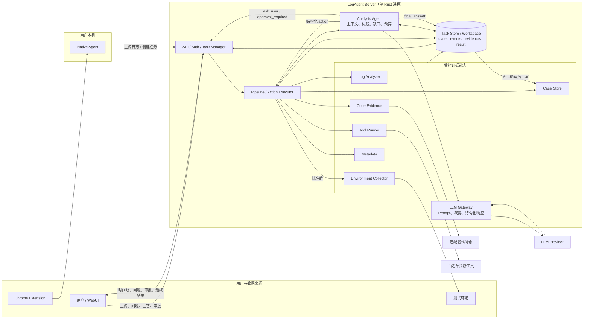

# LogAgent MVP 总览

本目录保留原始完整方案 [plan.md](./plan.md)，并按模块拆分为可独立推进的设计文档。

## 目标

LogAgent 是一个个人主导、业余时间可落地的日志分析助手 MVP。加入版本感知代码证据、测试环境采集、统一配置和测试策略后，第一版建议按 5~8 周规划，目标是把日志包或测试环境采集结果整理成高质量证据，并结合工具输出、对应版本代码实现和历史 Case，输出结构化故障分析结果。

## 技术选型原则

能用 Rust 实现的模块优先使用 Rust。整体语言优先级：

```text
Rust -> C/C++ -> Go/Python/Java 等
```

默认建议：

- 本地 Agent、服务端 API、日志分析器、工具调度器、代码证据、环境采集优先使用 Rust。
- 已有 C/C++ 工具可直接复用，通过 Tool Runner 统一调用。
- Python/Go/Java 主要作为已有生态或历史工具的兼容选项，不作为新模块首选。

核心链路：

```text
日志来源
  - 浏览器下载 / 手动上传
  - 测试环境 SSH/SCP 采集
    |
    v
基础证据提取
  - rg 日志检索
  - 实例和集群元数据
  - 外部工具调用
  - 对应版本代码检索
  - 环境状态采集
    |
    v
Analysis Agent 调查循环
  - 维护任务级上下文、事实、假设和信息缺口
  - 请求日志搜索、工具、代码、环境或用户补充
  - 控制轮次、动作和 token 预算
    |
    v
LLM Gateway
  - Prompt、证据裁剪、模型调用和结构化响应
    |
    v
人工确认
    |
    v
Case 沉淀与召回
```

## 规划架构图



关键控制边界：

- Analysis Agent 和 LLM Gateway 都不能直接执行工具、读取任意路径或连接 SSH。
- Server Action Executor 是唯一执行入口，负责 schema、白名单、预算、幂等和审批检查。
- 日志搜索、白名单工具和只读代码检索可自动执行；环境 SSH/SCP 采集默认等待用户批准。
- 所有任务上下文、事件、证据和结果都持久化到 Task Store / Workspace，支持重启恢复。
- Case Store 只接收人工确认后的最终结果。

## 模块目录

| 目录 | 模块 | Spec |
|------|------|------|
| [chrome-extension](./chrome-extension/README.md) | Chrome 插件，识别下载并触发上传 | [SPEC](./chrome-extension/SPEC.md) |
| [native-agent](./native-agent/README.md) | 本地 Rust Agent，接收插件请求并上传日志 | [SPEC](./native-agent/SPEC.md) |
| [server](./server/README.md) | Rust 服务端，任务、上传、调度和 API | [SPEC](./server/SPEC.md) |
| [log-analyzer](./log-analyzer/README.md) | 日志解压、manifest、rg 检索和摘要 | [SPEC](./log-analyzer/SPEC.md) |
| [tool-runner](./tool-runner/README.md) | 外部工具白名单调用 | [SPEC](./tool-runner/SPEC.md) |
| [code-evidence](./code-evidence/README.md) | 软件版本到代码分支映射和代码证据 | [SPEC](./code-evidence/SPEC.md) |
| [environment-collector](./environment-collector/README.md) | 测试环境 SSH/SCP 信息采集 | [SPEC](./environment-collector/SPEC.md) |
| [metadata](./metadata/README.md) | 实例 ID、集群节点和导入模板元数据管理 | [SPEC](./metadata/SPEC.md) |
| [analysis-agent](./analysis-agent/README.md) | 多轮调查编排、任务上下文、用户追问和终止控制 | [SPEC](./analysis-agent/SPEC.md) |
| [llm-agent](./llm-agent/README.md) | LLM Gateway，负责模型适配和结构化推理调用 | [SPEC](./llm-agent/SPEC.md) |
| [case-store](./case-store/README.md) | Case 沉淀、embedding 和相似召回 | [SPEC](./case-store/SPEC.md) |
| [webui](./webui/README.md) | Vite WebUI、任务证据和 Metadata 可视化 | [SPEC](./webui/SPEC.md) |
| [security](./security/README.md) | 安全边界和执行约束 | [SPEC](./security/SPEC.md) |
| [config](./config/README.md) | 单一 `logagent.yaml` 配置结构 | [SPEC](./config/SPEC.md) |
| [interfaces](./interfaces/README.md) | 模块边界、Rust trait 和状态机 | [SPEC](./interfaces/SPEC.md) |
| [deployment](./deployment/README.md) | 单二进制部署形态和系统依赖 | [SPEC](./deployment/SPEC.md) |
| [testing](./testing/README.md) | 测试 fixture、集成测试和 LLM stub | [SPEC](./testing/SPEC.md) |
| [roadmap](./roadmap/README.md) | 工期预估和迭代顺序 | [SPEC](./roadmap/SPEC.md) |

## MVP 边界

第一版不做企业级日志平台，不引入 Elasticsearch/OpenSearch、CMDB、监控接入、通用远程运维、复杂权限体系和 Multi-Agent 编排。

关键边界：

- 外部工具只允许白名单配置调用。
- LLM 不能直接执行任意命令。
- Analysis Agent 只产生结构化动作意图，所有动作由 Server 校验和执行。
- 安全只读动作可自动执行，SSH/SCP 远程采集默认需要用户批准。
- 代码仓只读检索，不自动改代码。
- SSH/SCP 只访问配置中的测试环境节点。
- pgvector 不是第一版硬依赖，Case embedding 可以先用本地文件或 SQLite。
- MVP 部署形态采用单一 Rust binary + 内部 crate/module 拆分。
- Agent 上下文只在当前任务内持久化；跨任务知识只来自人工确认后的 Case。
- 统一配置使用 `logagent.yaml`，密钥只引用环境变量。

## 开发约定

后续每开发或修改一个组件，都必须同步更新该组件目录下的 `README.md` 和 `SPEC.md`。

每次修改完文件，也必须同步更新根目录 [PROGRESS.md](./PROGRESS.md)，记录项目进展、行为变化、验证结果或下一步变化。

`README.md` 至少包含：

- 当前实现状态
- 配置项
- 本地运行方式
- 部署方式
- 健康检查或验证方式
- 与上下游组件的接口约定

`SPEC.md` 至少包含：

- 目标和职责边界
- 输入输出
- API 或数据产物
- 配置和安全约束
- 验收标准

已经写好的组件：

- `chrome-extension`
- `native-agent`
- `server`

这三个组件的 README 需要随着代码变化持续维护。
