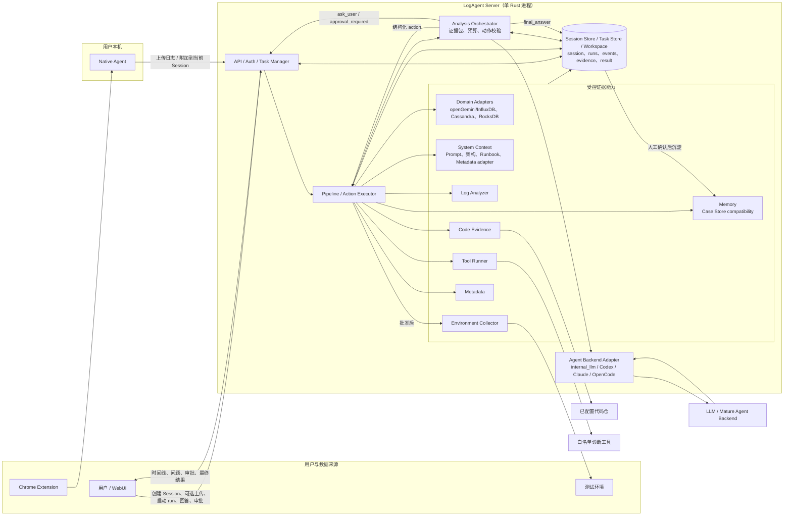

# LogAgent MVP 总览

当前权威文档入口是本总览、[SPEC.md](./SPEC.md)、各可运行组件目录，以及 [docs/modules](./docs/modules/README.md) 中的 Server 内部能力文档。

## 目标

LogAgent 是面向开发和运维诊断的证据工作台。它不再把自研通用 Agent Loop 作为核心差异化方向，而是把用户问题、日志包、元数据、工具结果、测试流水线、测试环境采集结果和历史 Case 整理成高质量证据包，再通过可插拔 Agent Backend 调用 Codex、Claude Code、OpenCode 或内部 LLM Gateway 生成结构化故障分析结果。

当前重点场景是快速问题分析、日志分析、日常测试流水线失败分析和数据库/存储系统专项诊断。第一批领域继续覆盖 openGemini/InfluxDB，并新增 Cassandra、RocksDB 的 Domain Adapter 骨架。

## 技术选型原则

能用 Rust 实现的模块优先使用 Rust。整体语言优先级：

```text
Rust -> C/C++ -> Go/Python/Java 等
```

默认建议：

- 本地 Agent、服务端 API、日志分析器、工具调度器、代码证据、环境采集优先使用 Rust。
- 已有 C/C++ 工具可直接复用，通过 Tool Runner 统一调用。
- Python/Go/Java 主要作为已有生态或历史工具的兼容选项，不作为新模块首选。

核心链路：

```text
日志来源
  - 浏览器下载 / 手动上传
  - 测试环境 SSH/SCP 采集
    |
    v
基础证据提取
  - rg 日志检索
  - System Context 背景资源
  - 实例和集群元数据
  - 外部工具调用
  - 对应版本代码检索
  - 环境状态采集
    |
    v
Analysis Orchestrator
  - 汇总任务证据、领域上下文和预算
  - 调用可插拔 Agent Backend
  - 校验后端返回的结构化动作或最终答案
    |
    v
Agent Backend
  - internal_llm / Claude Agent SDK / Codex CLI / Claude Code CLI / OpenCode CLI
  - 推理、代码上下文分析和结构化响应
    |
    v
人工确认
    |
    v
Case 沉淀与召回
```

## 规划架构图



关键控制边界：

- Analysis Orchestrator、LLM Gateway 和外部 Agent Backend 都不能直接执行工具、读取任意路径或连接 SSH。
- Server Action Executor 是唯一执行入口，负责 schema、白名单、预算、幂等和审批检查。
- 日志搜索、白名单工具和只读代码检索可自动执行；环境 SSH/SCP 采集默认等待用户批准。
- 外部 Agent Backend 第一阶段只做配置、诊断和契约产物冻结；Log Analysis run 会写出 `analysis_package.json`、`agent_request.json` 和 `agent_response.json`，当前仍由 `internal_llm` 执行 `PLAN_ANALYSIS`。
- Log Analysis 公开入口是可恢复的 Session；每次分析 run 仍创建一个 Server task workspace 快照。
- Session 可以只包含用户问题而不包含上传日志；这种 run 会生成 `session_text_input.json`、空 raw/input 快照、空 manifest 文件列表和空 grep evidence，再由 Analysis Orchestrator 基于问题、Metadata、Case 和后续交互继续分析。
- Log Analysis run 会固化 `system_context.json`，把已启用的 Prompt Pack、架构文档、Runbook、工具能力说明和 Metadata adapter 摘要作为背景参考带入 Prompt；System Context 不能替代当前任务证据。
- 成功的 Log Analysis run 会在最终结果生成后静默调用 LLM Gateway 生成短 alias，用于 WebUI 展示；该命名调用不写入 Session timeline 或 analysis events。
- 所有 Session、任务上下文、事件、证据和结果都持久化到 Session Store / Task Store / Workspace，支持重启恢复。
- WebUI 可实时展示 Task execution loop 摘要；LLM response content 日志只能通过顶部 debug 开关手动开启。
- Memory 当前只激活 `memoryType=case`，通过兼容的 Case API 接收人工确认后的 Case，包括成功任务最终结果确认和用户通过 LLM-assisted 文本导入确认的手工 Case。

## 项目目录

根目录只保留当前真实可运行的组件和工程支撑目录。日志分析、Metadata、Tool Runner、Analysis Orchestrator、Agent Backends、Domain Adapters、LLM Gateway、Memory/Case Store 等能力目前都作为 `server` crate 的内部模块实现；后续确实需要独立发布或部署时，再从 Server 内部迁出。

| 目录 | 职责 | Spec |
|------|------|------|
| [chrome-extension](./chrome-extension/README.md) | Chrome 插件，识别下载并触发上传 | [SPEC](./chrome-extension/SPEC.md) |
| [native-agent](./native-agent/README.md) | 本地 Rust Agent，接收插件请求并上传日志 | [SPEC](./native-agent/SPEC.md) |
| [server](./server/README.md) | Rust 服务端，任务、上传、证据流水线、内部能力和 API | [SPEC](./server/SPEC.md) |
| [webui](./webui/README.md) | Vite WebUI、任务证据、Memory、System Context、Metadata、Tools 和 Settings 可视化 | [SPEC](./webui/SPEC.md) |
| [deploy](./deploy/README.md) | Runtime 部署模板、环境变量示例、服务控制和重建安装脚本 | [Deployment SPEC](./docs/modules/deployment/SPEC.md) |
| [examples](./examples) | 本地配置样例和工具 smoke 配置 | - |
| [scripts](./scripts) | 工作目录初始化、Server/WebUI 快捷编译、服务启停和 smoke 脚本 | - |
| [testing](./testing/README.md) | 测试 fixture、集成测试和 LLM stub | [SPEC](./testing/SPEC.md) |

Server 内部能力的设计文档已归档到 [docs/modules](./docs/modules/README.md)：

| 能力 | 文档 |
|------|------|
| Agent Backends | [README](./docs/modules/agent-backends/README.md) / [SPEC](./docs/modules/agent-backends/SPEC.md) |
| Log Analyzer | [README](./docs/modules/log-analyzer/README.md) / [SPEC](./docs/modules/log-analyzer/SPEC.md) |
| Tool Runner | [README](./docs/modules/tool-runner/README.md) / [SPEC](./docs/modules/tool-runner/SPEC.md) |
| Domain Adapters | [README](./docs/modules/domain-adapters/README.md) / [SPEC](./docs/modules/domain-adapters/SPEC.md) |
| Metadata | [README](./docs/modules/metadata/README.md) / [SPEC](./docs/modules/metadata/SPEC.md) |
| System Context | [README](./docs/modules/system-context/README.md) / [SPEC](./docs/modules/system-context/SPEC.md) |
| Analysis Agent | [README](./docs/modules/analysis-agent/README.md) / [SPEC](./docs/modules/analysis-agent/SPEC.md) |
| LLM Gateway | [README](./docs/modules/llm-gateway/README.md) / [SPEC](./docs/modules/llm-gateway/SPEC.md) |
| Memory / Case Store compatibility | [README](./docs/modules/case-store/README.md) / [SPEC](./docs/modules/case-store/SPEC.md) |
| Memory | [README](./docs/modules/memory/README.md) / [SPEC](./docs/modules/memory/SPEC.md) |
| Code Evidence | [README](./docs/modules/code-evidence/README.md) / [SPEC](./docs/modules/code-evidence/SPEC.md) |
| Environment Collector | [README](./docs/modules/environment-collector/README.md) / [SPEC](./docs/modules/environment-collector/SPEC.md) |
| Config / Interfaces / Security / Deployment / Roadmap | [docs/modules](./docs/modules/README.md) |

## MVP 边界

第一版不做企业级日志平台，不引入 Elasticsearch/OpenSearch、CMDB、监控接入、通用远程运维、复杂权限体系和 Multi-Agent 编排，也不尝试替代 Codex、Claude Code 或 OpenCode。

关键边界：

- 外部工具只允许白名单配置调用。
- LLM 不能直接执行任意命令。
- Agent Backend 只产生结构化动作意图或最终答案，所有动作由 Server 校验和执行。
- 安全只读动作可自动执行，SSH/SCP 远程采集默认需要用户批准。
- 代码仓只读检索，不自动改代码。
- SSH/SCP 只访问配置中的测试环境节点。
- pgvector 不是第一版硬依赖，Case embedding 可以先用本地文件或 SQLite。
- MVP 部署形态采用单一 Rust Server binary + Server 内部分层 module；后续确有独立生命周期时再拆 crate 或服务。
- Agent 上下文只在当前任务内持久化；跨任务知识只来自人工确认后的 Case。
- 统一配置使用 `logagent.yaml`，密钥只引用环境变量。

## 当前优先级

当前阶段优先把 LogAgent 重构为“诊断证据工作台 + Agent Backend Adapter + Domain Adapter”：保留 Session-first Log Analysis、System Context、上传、Metadata、Tool Runner、Tools 页面和 Case Store，新增成熟 agent 后端适配配置/诊断接口和外部 agent contract artifacts，首个目标后端为 `claude_agent_sdk` adapter，并把 openGemini/InfluxDB、Cassandra、RocksDB 作为领域能力包管理。`influxql-analyzer` 已配置到 `/usr/bin/influxql-analyzer` 可直接调用，相关代码和文档在 `/home/duzhiwang/workspace/influxql`。Tools 页面已先接入 `pprof_analyzer` 示例工具，通过配置中的 Go 可执行文件运行 `go tool pprof`。

Code Evidence 和真实 SSH/SCP Environment Collector 延后到产品闭环稳定后实现；当前 `collect_environment` 仍保留审批流程和 mock evidence，用于验证交互闭环。

## 开发约定

后续每开发或修改一个可运行组件，都必须同步更新该组件目录下的 `README.md` 和 `SPEC.md`；修改 Server 内部能力时，同步更新 `server/README.md`、`server/SPEC.md`，必要时更新 `docs/modules/` 下对应能力文档。

每次修改完文件，也必须同步更新根目录 [PROGRESS.md](./PROGRESS.md)，记录项目进展、行为变化、验证结果或下一步变化。

`README.md` 至少包含：

- 当前实现状态
- 配置项
- 本地运行方式
- 部署方式
- 健康检查或验证方式
- 与上下游组件的接口约定

`SPEC.md` 至少包含：

- 目标和职责边界
- 输入输出
- API 或数据产物
- 配置和安全约束
- 验收标准

已经写好的可运行组件：

- `chrome-extension`
- `native-agent`
- `server`
- `webui`

这些组件的 README 需要随着代码变化持续维护。
