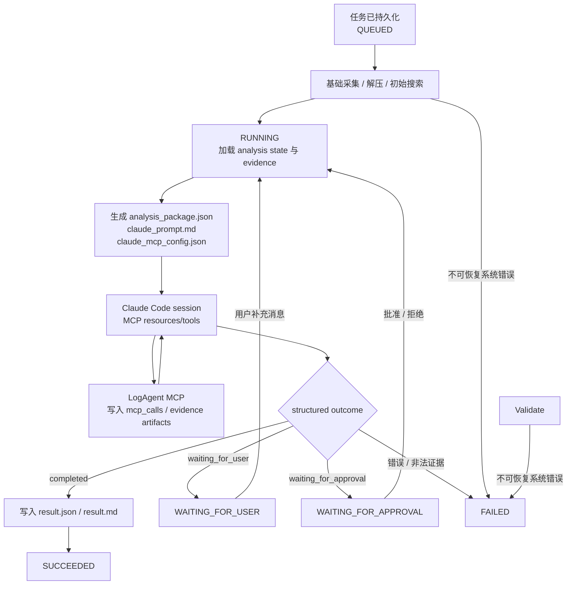

# LogAgent MVP Spec

## 目标

LogAgent 把用户问题、日志包、元数据、工具结果、测试流水线或测试环境采集结果转换成可审计证据链。Server 负责证据采集、领域适配、状态、MCP 能力和执行边界；Claude Code 负责通用推理、代码上下文分析和结构化结果生成。

产品入口分为两个层级：

- WebUI `Analyze` 是团队主入口，负责 Session-first 分析、上传、用户追问、审批、Server 本机 Claude Code 调用和结果确认。
- 只读 HTTP MCP 是个人高级入口，个人本地 Claude Code 可读取共享 Server 的 Case、System Context、Skills、Metadata、工具目录和 Domain Adapter 摘要；该入口不读取或操作 Session，不上传文件，不运行远程工具，不审批，不写入 Server 数据。

当前产品方向是诊断证据工作台和 Claude Code 的领域诊断增强层，不替代 Claude Code，而是通过 LogAgent MCP server 提供日志、Metadata、System Context、Domain Tools、Case 和审批能力，并在 openGemini/InfluxDB、Cassandra、RocksDB 等领域提供专项增强。

第一阶段目标是跑通：

```text
WEBUI 创建/选择 Session，填写问题，可选 Chrome 下载或 WEBUI 上传
  -> Native Agent 或 Server 上传接口
  -> 可选附加 upload 到 Session
  -> 用户显式启动一次分析 run
  -> Server task workspace 快照
  -> 解压与 manifest
  -> grep 证据
  -> WEBUI 查看证据
```

## 技术原则

新实现优先使用 Rust，语言优先级：

```text
Rust -> C/C++ -> Go/Python/Java 等
```

已有编译工具可复用，不强制重写。外部工具统一通过白名单配置和 Tool Runner 调用。

V2 重构分支 `rewrite/logagent-v2` 作为 clean-room 架构评估例外，允许以 Python/FastAPI/LangGraph-oriented runtime 重新实现 Server。该分支面向小团队单机部署，默认使用 SQLite WAL、本地 artifact store 和 DB-backed job queue，不引入 PostgreSQL/Redis，也不要求兼容 Rust V1 API。

## 组件和内部能力边界

当前可运行组件：

| 组件 | Spec |
|------|------|
| Chrome Extension | [chrome-extension/SPEC.md](./chrome-extension/SPEC.md) |
| Native Agent | [native-agent/SPEC.md](./native-agent/SPEC.md) |
| Server | [server/SPEC.md](./server/SPEC.md) |
| Server V2 | [server-v2/SPEC.md](./server-v2/SPEC.md) |
| WebUI | [webui/SPEC.md](./webui/SPEC.md) |
| Testing | [testing/SPEC.md](./testing/SPEC.md) |

Server 内部能力目前不拆独立目录或 crate，设计文档统一归档在 `docs/modules/`：

| 能力 | Spec |
|------|------|
| Claude Code Session Runner | [docs/modules/agent-backends/SPEC.md](./docs/modules/agent-backends/SPEC.md) |
| Log Analyzer | [docs/modules/log-analyzer/SPEC.md](./docs/modules/log-analyzer/SPEC.md) |
| Tool Runner / Fetch / Huawei Package Sync | [docs/modules/tool-runner/SPEC.md](./docs/modules/tool-runner/SPEC.md) |
| Domain Adapters | [docs/modules/domain-adapters/SPEC.md](./docs/modules/domain-adapters/SPEC.md) |
| Code Evidence | [docs/modules/code-evidence/SPEC.md](./docs/modules/code-evidence/SPEC.md) |
| Environment Collector | [docs/modules/environment-collector/SPEC.md](./docs/modules/environment-collector/SPEC.md) |
| Metadata | [docs/modules/metadata/SPEC.md](./docs/modules/metadata/SPEC.md) |
| Skills | [docs/modules/skills/SPEC.md](./docs/modules/skills/SPEC.md) |
| System Context | [docs/modules/system-context/SPEC.md](./docs/modules/system-context/SPEC.md) |
| Analysis Agent | [docs/modules/analysis-agent/SPEC.md](./docs/modules/analysis-agent/SPEC.md) |
| LLM Gateway | [docs/modules/llm-gateway/SPEC.md](./docs/modules/llm-gateway/SPEC.md) |
| Memory / Case Store compatibility | [docs/modules/case-store/SPEC.md](./docs/modules/case-store/SPEC.md) |
| Memory | [docs/modules/memory/SPEC.md](./docs/modules/memory/SPEC.md) |
| Config | [docs/modules/config/SPEC.md](./docs/modules/config/SPEC.md) |
| Interfaces | [docs/modules/interfaces/SPEC.md](./docs/modules/interfaces/SPEC.md) |
| Deployment | [docs/modules/deployment/SPEC.md](./docs/modules/deployment/SPEC.md) |
| Security | [docs/modules/security/SPEC.md](./docs/modules/security/SPEC.md) |
| Roadmap | [docs/modules/roadmap/SPEC.md](./docs/modules/roadmap/SPEC.md) |

## 核心数据流

上传来源：

```text
Chrome Extension -> Native Agent -> Server upload API -> Session uploads
WEBUI -> Server upload API -> Session uploads
Question-only Session -> explicit analysis run -> Task pipeline
Session uploads -> explicit analysis run -> Task pipeline
```

测试环境来源：

```text
WEBUI/Server task -> Environment Collector -> Server workspace -> Task pipeline
```

证据处理：

```text
raw file -> extracted files -> initial evidence
  -> system_context.json diagnostic skills and metadata background
  -> domain adapter evidence summary
  -> Analysis Orchestrator context
  -> Claude MCP config
  -> Claude Code session uses MCP resources/tools
  -> Server persists MCP evidence / waiting state / audit
  -> structured Claude outcome
  -> final result
```

Analysis Orchestrator 使用任务级持久化上下文：

```text
analysis_state.json
analysis_events.jsonl
system_context.json
result.json
result.md
```

Claude Code 通过 LogAgent MCP tools 请求领域能力并返回结构化 session outcome。Server 是日志搜索、领域工具、代码检索和远程采集的唯一执行者。

## 调查循环图



状态和阶段分离：

- 稳定状态：`QUEUED`、`RUNNING`、`WAITING_FOR_USER`、`WAITING_FOR_APPROVAL`、`SUCCEEDED`、`FAILED`。
- 执行阶段：`COLLECT`、`EXTRACT`、`SEARCH_LOGS`、`RUN_TOOL`、`COLLECT_CODE`、`PLAN_ANALYSIS`、`EXECUTE_ACTION`、`GENERATE_RESULT` 等。
- 预算耗尽或证据不足属于可解释的分析终止，通常生成低置信度结果并进入 `SUCCEEDED`；只有不可恢复系统错误进入 `FAILED`。

## 当前已实现

- Chrome Extension 识别下载完成并调用 Native Agent。
- Native Agent 接收本地导入请求，校验路径、后缀和大小，可配置上传到 Rust V1 Server 或 V2 Session-scoped 上传接口。
- Server 支持 multipart 上传、分片上传、任务创建、任务产物读取。
- Server 支持 Log Analysis Session：创建/列表/读取/草稿更新、删除非运行中 Session、附加/移除上传、按 Session 创建多次 task run、统一 timeline。删除 Session 只移除 Session record 和 Session timeline，不级联删除上传、task workspace 或结果产物。
- Log Analysis Session 支持不上传日志直接启动分析；Task snapshot 的 `uploadIds` 和 `inputs` 为空，pipeline 仍生成 `session_text_input.json`、空 `manifest.json` / `grep_results.json` 并进入 Analysis Orchestrator。
- 成功 Log Analysis task 持久化 `alias`；alias 由最终结果生成后的独立 LLM Gateway 调用产生，失败时回退到最终 summary/question 的短标题，且该调用不进入 timeline。
- Log Analysis task schema 强制带 `sessionId`；旧的无 Session task 不再兼容展示。
- Server 持久化任务并在后台执行，支持重启恢复。
- Upload session 持久化并支持重启续传。
- Metadata 接入 task context，完整写入 workspace `metadata_context.json`；Claude Code 初始 `analysis_package.json` 和任务 MCP 默认 `metadata_context` resource 只暴露 `metadataContextOutline`，细节通过 `logagent.query_metadata` 按 section/filter/分页读取。
- Skill-backed System Context 接入 task context，支持 Codex-compatible Diagnostic Skills、`logagent.json` 匹配 manifest、Markdown Skill 导入、按需 MCP reference 读取和 Metadata adapter；创建 Log Analysis run 时写入 `system_context.json` 并进入 Claude Code 背景区。
- Server 新增受保护只读 HTTP MCP：`POST /api/mcp/readonly`，支持 `initialize`、`resources/list`、`resources/read`、`tools/list` 和 `tools/call`，只暴露 Skills、Metadata、Case、工具目录和 Domain Adapter 等共享知识。
- Server 新增受保护导出下载：`GET /api/exports/skills.zip` 和 `GET /api/exports/tools.zip`。`skills.zip` 打包当前索引 Skill 普通文件并跳过 symlink；`tools.zip` 对 enabled 且可执行的工具做平台二进制快照，缺失或不可执行工具只在 manifest 标记 skipped。
- Claude Code Session Runner 已支持 `claude_code` 配置、`analysisMode=diagnose|code_investigation|fix`、Settings 摘要和 dry-run 诊断；旧 `agent_backends` 配置不再作为运行入口。
- Domain Adapters 第一阶段已内置 `opengemini_influxdb` active adapter，以及 `cassandra`、`rocksdb` skeleton adapter，并通过 Settings API 暴露摘要。
- Executor 按持久化 phase 调度并从中断阶段恢复，公共 Action/Evidence 契约已落地。
- Tool Runner MVP 支持白名单工具配置、规则版多输入工具 action、`RUN_TOOL` phase、Claude MCP `logagent.run_domain_tool`、`tool_results` artifact 和 JSON stdout summary/findings 解析；真实 InfluxQL、Flux、openGemini storage 和 InfluxDB 1.x storage analyzers 已通过 `third_party/` submodules 引用，并由 `scripts/build-tools.sh` 构建到 LogAgent 工具目录。源码构建阶段支持通过 `LOGAGENT_SUBMODULE_BASE_URL` 或各 `LOGAGENT_SUBMODULE_*_URL` 手动覆盖 submodule clone 地址，便于无法访问 GitHub 的内网镜像环境部署；该覆盖只写 submodule config，不得改写顶层仓库 `origin`。`scripts/smoke-influxql-analyzer.sh` 已覆盖真实 InfluxQL Report 和 CompareReport 两条 CLI 路径。
- Fetch endpoint MVP 支持 `fetch` 配置段、DevTools bash cURL 导入预览、endpoint CRUD、加密 credential set、allowlist 出网校验、WebUI 手动运行、任务 MCP `logagent.list_fetch_endpoints` / `logagent.fetch` 和 `tool_results/<action_id>/result.json#response` evidence ref。任务 MCP Fetch 使用稳定 `act_fetch_<digest>` action id，并返回 Rust/V1 顶层状态字段；Fetch result 使用 Rust/V1 `schemaVersion=3` tool result envelope，并附带 V2 response-body artifact id/path；只读 HTTP MCP 只展示工具目录 descriptor，不允许执行 `logagent.fetch`。
- Log Analyzer 支持节点日志包预处理：匹配 `<packageId>_<instanceId>_<nodeId>_<timestamp>_logs.tar.gz` 的包会按节点和时间展开到 `extracted/<nodeId>/<timestamp>/{tsdb,stream,agent}/`，archive 内允许顶层包装目录和 `./` 等目录项，路径中匹配 `var/chroot/gemini/log/{tsdb,stream}` 或 `home/Ruby/log` 的文件会归类到对应日志组；目录内轮转日志不依赖文件名后缀，gzip 内容按 magic bytes 透明解码，并生成 `tool_inputs/index.json`、通用日志 JSONL 和 `influxql_analyzer` JSONL 输入。匹配当前工具的 materialized input 会作为独占自动输入，避免工具继续回退读取原始轮转日志。节点包若没有任何支持日志目录会失败并返回明确错误，避免空 manifest 被误判为成功解包。
- 任务 MCP `logagent.search_logs` 的后续检索写入 `log_searches/logsearch_*.json`，返回命中行正文、`keywordCounts`、`unmatchedKeywords` 和稳定 `log_searches/...#matches/<index>` refs，不再覆盖初始 `grep_results.json`。`logagent.get_log_slice` 写入稳定 `log_slices/slice_<digest>.json#lines` refs。Claude Code prompt 明确要求检查 `matches[].text`，禁止只根据 `totalMatches` 推断异常类型或技术栈。
- Tools API MVP 支持 `tool_run` 任务、工具目录、手动创建工具运行、运行状态轮询、结果/artifact 查询；`/api/tasks` 默认只返回日志分析任务，工具运行通过 `/api/tools/runs` 查询。
- `pprof_analyzer` 已作为第一个 Tools 插件接入，复用上传、TaskStore、workspace、后台 Executor 和 `tool_results` 目录，通过配置中的 Go 可执行文件运行 `go tool pprof`，生成 top/tree/raw 结果并解析 top 表格。
- `logagent.huawei_cloud_package_sync` 已作为默认关闭的内置 Tools runnable 接入：启用 `huawei_cloud.package_sync.enabled=true` 后，手动 `tool_run` 必须引用一个已上传包，Server 将包流式 PUT 到配置的 Huawei OBS，执行 GaussDB update SQL，再执行 OBS HEAD 和 GaussDB query SQL，结果写入 `tool_results/<action_id>/result.json`。OBS/GaussDB 密钥只来自环境变量，artifact 只记录环境变量名、对象 key、状态、耗时和 bounded 查询行。
- Remote Executor MVP 支持 WebUI 纳管 ECS 执行机、读取白名单命令模板、创建 `remote_command_run` task、后台 `EXECUTE_REMOTE_COMMAND` phase 调用系统 `ssh` 执行模板 argv，并通过 `/api/executor-runs` 查询 stdout/stderr/result artifact；默认 `smoke_ls_root` 模板用于低风险 SSH smoke。V2 审批后的 `collect_environment` 还可通过白名单 file template SCP 拉取单个有大小上限的远程文件，并把 `collected_file` 注册为 support artifact。
- 根目录 `deploy/` 提供 runtime 部署模板，包含 `.env.example`、`logagent.example.yaml`、`logagentctl.sh`、`rebuild-install.sh` 和 README；脚本可自动加载 runtime `deploy/.env`。
- `scripts/v2-local.sh` 提供 V2 本地快速 build/start/stop/restart/status/logs，默认复用 `server-v2/.venv`、`/tmp/logagent-v2-local`、端口 `50993` 和 `target/tools`，显式 `--with-tools` / `--only-tool` 时才构建 source-built analyzers。
- Analysis State Store MVP 已写入 `analysis_state.json` / `analysis_events.jsonl`，并提供 `GET /api/tasks/:task_id/analysis` 读取当前快照和事件流；`PLAN_ANALYSIS` 的 Claude Code session 调用会记录 callId、attempt、session artifact 和完成事件。
- Log Analysis run 会在 `PLAN_ANALYSIS` 前刷新 `analysis_package.json`、`claude_prompt.md` 和 `claude_mcp_config.json`，随后用短 stdin prompt 调用 Claude Code CLI，并由 Claude 通过任务 MCP `analysis_package` resource 读取证据包；其中 Metadata 只包含 outline/counts，不内联完整 databases/measurements/shards/indexes。`logagent.get_metadata_topology` 作为兼容 alias 返回 outline，`logagent.query_metadata` 会写入 `metadata_slices/<stable_id>.json` 并审计到 `mcp_calls.jsonl`。`logagent.get_metadata_field_types` 查询任意字段类型，`logagent.get_metadata_tag_fields` 只查询 Tag 字段；二者均作为背景上下文。`claude_session.json`、`mcp_calls.jsonl` 和真实 `agent_response.json` 记录 session、MCP 调用和响应。`agent_response.json` 现在表示 Claude Code session response，包含 `runtimeStatus`、`claudeSessionId`、`analysisMode`、`permissionProfile`、`promptDelivery`、`structuredOutput`、usage/cost、耗时、MCP call 路径和错误；V2 会在每次 Claude Code provider 响应后刷新 runtime `claude_session.json`，失败响应即使没有 session id 也会覆盖初始 contract 形成可审计运行态。
- Analysis Orchestrator 已支持 `ask_user` 进入 `WAITING_FOR_USER`，通过 `POST /api/tasks/:task_id/messages` 接收回答后恢复同一任务。
- Analysis Orchestrator 已支持 Claude MCP `request_approval` 进入 `WAITING_FOR_APPROVAL`，通过 `POST /api/tasks/:task_id/actions/:action_id/decision` 批准或拒绝后恢复；审批后的 Remote Executor 命令和 V2 单文件 SCP 采集已接入 Environment Collector evidence 闭环。
- Memory MVP 已支持 `memoryType=case`、兼容 Case schema v2 API、成功任务人工确认、LLM-assisted 文本导入手工 Case、SQLite/FTS 本地索引、legacy JSON 启动导入、关键词 fallback 召回和禁用。
- 最终结果 evidence refs 支持历史 Case canonical 引用 `case_context.json#cases/<index>`；真实模型输出 `case_<id>` 或“历史案例 case_<id>”时会按当前 task 的 `case_context.json` 规范化。
- Log Analyzer 支持 `.log`、`.txt`、`.zip`、`.tar.gz`、`.tgz`、`.tar`。
- LLM Gateway 支持 stub、OpenAI-compatible Chat Completions 和预留 binary provider；当前保留给 Case import、alias 生成和非 Agent Loop 的辅助结构化任务。Log Analysis 的 `PLAN_ANALYSIS` 不再调用 LLM Gateway 决策入口。
- V2 OpenAI-compatible Agent provider 的 `agent_response.json` 已保存稳定
  provider 审计字段，包括 request id、response id、response model、finish
  reason、usage、system fingerprint 和 allowlist response headers；HTTP 失败会
  额外写入稳定 `error.classification`、`error.retryable` 和 `httpStatus`；
  binary / Claude Code 本地 provider 失败也会写入同一分类字段。
- WEBUI 使用 React + Vite，Log Analysis 已改为 Session-first，顶部主入口显示为 Analyze，顶部导航顺序为 Analyze、Memory、System Context、Tools、Settings；支持 Session history、新建/删除非运行中 Session、草稿自动保存、Diagnostic Skill 选择和 Markdown 导入、上传附加、同一 Session 多次 run、统一 evidence timeline、Task execution 摘要、Claude Code session / MCP calls 展示、单次 LLM 结果、顶部 LLM debug 开关、Memory 管理页面、System Context 的 Skills/Metadata 页面、完整 Metadata 拓扑、Metadata Raw JSON 手动刷新和单条删除、Tools 工具集和 Executors 执行机页面、Settings Claude Code/LLM/Domain Adapter 诊断、Personal Claude Code 只读入口、Diagnostics 和 Raw JSON。

## 待实现能力

- 围绕“诊断证据工作台 + Claude Code MCP 增强层 + Domain Adapter”补齐完整产品闭环。
- 将更多工具按 Tools 插件描述接入，并让 MCP `logagent.run_domain_tool` 复用同一个工具 registry。
- 基于真实生产 Flux 查询日志继续扩展 `flux_query_analyzer` 输入转换、模板风险规则和 baseline 新模板解释。
- 基于真实 TSSP/TSI/TSM/series fixture 扩展 openGemini 和 InfluxDB storage analyzers 的解析深度和 finding 规则。
- Fetch 后续补齐 token refresh policy、更多 curl 方言和 endpoint schema 版本迁移；v1 只支持 bash 风格 cURL 和手动 credential set。
- Analysis Orchestrator 更完整的用户追问/审批策略、恢复幂等审计和产品化交互。
- LLM Gateway 继续收敛 Rust V1 辅助路径和 alias/Case import 的用量审计、
  Provider request id 与稳定结构化协议；V2 Agent provider 审计字段已先行落地。
- Memory embedding/vector 召回和自动注入 analysis evidence bundle。
- Cassandra 和 RocksDB domain adapter 的日志模式、工具和 fixture。
- Code Evidence V2 只读 `git grep` MVP 已支持 product/version 到配置 ref 的映射和最终答案 code evidence ref；绑定 Metadata instance 的 run 会继承并校验该 instance 的 product/version；后续继续实现独立 worktree/cache、版本 diff、符号级解析和 fix mode 隔离修改。
- 基于已落地的 Remote Executor 命令和 V2 单文件 SCP 采集，继续实现测试环境多节点批量 SSH/SCP 采集、Agent 自动选择 executor/template 和更多环境模板。
- V2 clean-room 分支已完成默认 WebUI V2 cutover，继续推进真实领域 fixture 和产品化验证；日志解压/search、拆分为 provider/tool/validation/result 节点的 LangGraph Agent runtime、Tool Runner、Metadata、Skills、Case Memory、Fetch、Remote Executor、单文件 SCP Environment Collector MVP、Code Evidence 只读检索、核心 MCP 面、Native Agent V2 target 和默认 WebUI 路由已迁移到 V2。

## 全局验收

- 本地 `cargo fmt --check`、`cargo check`、`cargo test` 通过。
- WEBUI 能完成上传、创建任务、读取证据。
- API 受 API Key 保护，密钥不写入日志或产物。
- 压缩包解压不能逃逸 workspace。
- Claude Code 的 MCP tool 调用和最终 evidence refs 必须经过 schema、白名单、预算和审批校验；`system_context.json`、`diagnostic_skill`、`skill_references/*` 和 `metadata_slices/*` 只能作为背景，不能作为根因 evidence ref。
- Fetch endpoint 默认关闭；启用时必须提供 32-byte base64 secret key 和 `fetch.allowed_hosts`，所有请求和 redirect hop 都必须命中 allowlist，最终结果只接受当前任务真实 `tool=logagent.fetch` action 的 `tool_results/<action_id>/result.json#response` 引用。
- Claude Code permission profile 必须默认允许 `mcp__logagent__*`，否则 `dontAsk` 模式会拒绝任务 MCP tools；LogAgent 用户审批 API 只处理 Server 侧 action，不改变 Claude CLI tool allowlist。
- 任务能从 `WAITING_FOR_USER` / `WAITING_FOR_APPROVAL` 接收输入并恢复；`WAITING_FOR_USER` 可通过 `resumeMode=finalize` 表示用户无更多补充信息，下一轮必须直接生成最终结果。
- 后续每个功能变更必须同步更新对应模块 `README.md` 和 `SPEC.md`。
