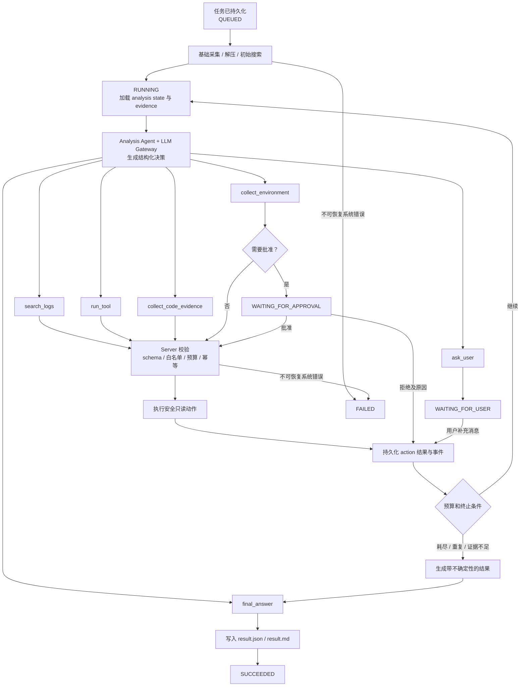

# LogAgent MVP Spec

## 目标

LogAgent 把用户问题、日志包或测试环境采集结果转换成可审计证据链，由 Analysis Agent 在受限预算内多轮识别信息缺口、请求补充证据并输出结构化故障分析。

第一阶段目标是跑通：

```text
WEBUI 创建/选择 Session，填写问题，可选 Chrome 下载或 WEBUI 上传
  -> Native Agent 或 Server 上传接口
  -> 可选附加 upload 到 Session
  -> 用户显式启动一次分析 run
  -> Server task workspace 快照
  -> 解压与 manifest
  -> grep 证据
  -> WEBUI 查看证据
```

## 技术原则

新实现优先使用 Rust，语言优先级：

```text
Rust -> C/C++ -> Go/Python/Java 等
```

已有编译工具可复用，不强制重写。外部工具统一通过白名单配置和 Tool Runner 调用。

## 组件和内部能力边界

当前可运行组件：

| 组件 | Spec |
|------|------|
| Chrome Extension | [chrome-extension/SPEC.md](./chrome-extension/SPEC.md) |
| Native Agent | [native-agent/SPEC.md](./native-agent/SPEC.md) |
| Server | [server/SPEC.md](./server/SPEC.md) |
| WebUI | [webui/SPEC.md](./webui/SPEC.md) |
| Testing | [testing/SPEC.md](./testing/SPEC.md) |

Server 内部能力目前不拆独立目录或 crate，设计文档统一归档在 `docs/modules/`：

| 能力 | Spec |
|------|------|
| Log Analyzer | [docs/modules/log-analyzer/SPEC.md](./docs/modules/log-analyzer/SPEC.md) |
| Tool Runner | [docs/modules/tool-runner/SPEC.md](./docs/modules/tool-runner/SPEC.md) |
| Code Evidence | [docs/modules/code-evidence/SPEC.md](./docs/modules/code-evidence/SPEC.md) |
| Environment Collector | [docs/modules/environment-collector/SPEC.md](./docs/modules/environment-collector/SPEC.md) |
| Metadata | [docs/modules/metadata/SPEC.md](./docs/modules/metadata/SPEC.md) |
| Analysis Agent | [docs/modules/analysis-agent/SPEC.md](./docs/modules/analysis-agent/SPEC.md) |
| LLM Gateway | [docs/modules/llm-gateway/SPEC.md](./docs/modules/llm-gateway/SPEC.md) |
| Case Store | [docs/modules/case-store/SPEC.md](./docs/modules/case-store/SPEC.md) |
| Config | [docs/modules/config/SPEC.md](./docs/modules/config/SPEC.md) |
| Interfaces | [docs/modules/interfaces/SPEC.md](./docs/modules/interfaces/SPEC.md) |
| Deployment | [docs/modules/deployment/SPEC.md](./docs/modules/deployment/SPEC.md) |
| Security | [docs/modules/security/SPEC.md](./docs/modules/security/SPEC.md) |
| Roadmap | [docs/modules/roadmap/SPEC.md](./docs/modules/roadmap/SPEC.md) |

## 核心数据流

上传来源：

```text
Chrome Extension -> Native Agent -> Server upload API -> Session uploads
WEBUI -> Server upload API -> Session uploads
Question-only Session -> explicit analysis run -> Task pipeline
Session uploads -> explicit analysis run -> Task pipeline
```

测试环境来源：

```text
WEBUI/Server task -> Environment Collector -> Server workspace -> Task pipeline
```

证据处理：

```text
raw file -> extracted files -> initial evidence
  -> Analysis Agent context
  -> action -> Server validation/execution -> new evidence
  -> ask user / request approval / next round
  -> final result
```

Analysis Agent 使用任务级持久化上下文：

```text
analysis_state.json
analysis_events.jsonl
result.json
result.md
```

模型只通过 LLM Gateway 返回结构化 action 或最终答案候选。Server 是日志搜索、工具、代码检索和远程采集的唯一执行者。

## 调查循环图



状态和阶段分离：

- 稳定状态：`QUEUED`、`RUNNING`、`WAITING_FOR_USER`、`WAITING_FOR_APPROVAL`、`SUCCEEDED`、`FAILED`。
- 执行阶段：`COLLECT`、`EXTRACT`、`SEARCH_LOGS`、`RUN_TOOL`、`COLLECT_CODE`、`PLAN_ANALYSIS`、`EXECUTE_ACTION`、`GENERATE_RESULT` 等。
- 预算耗尽或证据不足属于可解释的分析终止，通常生成低置信度结果并进入 `SUCCEEDED`；只有不可恢复系统错误进入 `FAILED`。

## 当前已实现

- Chrome Extension 识别下载完成并调用 Native Agent。
- Native Agent 接收本地导入请求，校验路径、后缀和大小，上传 Server。
- Server 支持 multipart 上传、分片上传、任务创建、任务产物读取。
- Server 支持 Log Analysis Session：创建/列表/读取/草稿更新、附加/移除上传、按 Session 创建多次 task run、统一 timeline。
- Log Analysis Session 支持不上传日志直接启动分析；Task snapshot 的 `uploadIds` 和 `inputs` 为空，pipeline 仍生成 `session_text_input.json`、空 `manifest.json` / `grep_results.json` 并进入 Analysis Agent。
- 成功 Log Analysis task 持久化 `alias`；alias 由最终结果生成后的独立 LLM Gateway 调用产生，失败时回退到最终 summary/question 的短标题，且该调用不进入 timeline。
- Log Analysis task schema 强制带 `sessionId`；旧的无 Session task 不再兼容展示。
- Server 持久化任务并在后台执行，支持重启恢复。
- Upload session 持久化并支持重启续传。
- Metadata 接入 task context，写入 `metadata_context.json` 并进入 LLM Prompt。
- Executor 按持久化 phase 调度并从中断阶段恢复，公共 Action/Evidence 契约已落地。
- Tool Runner MVP 支持白名单工具配置、规则版多输入 `run_tool` action、`RUN_TOOL` phase、`tool_results` artifact 和 JSON stdout summary/findings 解析；真实 `influxql-analyzer` Report stdout 已适配为结构化 findings 并通过本地 smoke，当前本机路径为 `/usr/bin/influxql-analyzer`。
- Tools API MVP 支持 `tool_run` 任务、工具目录、手动创建工具运行、运行状态轮询、结果/artifact 查询；`/api/tasks` 默认只返回日志分析任务，工具运行通过 `/api/tools/runs` 查询。
- `pprof_analyzer` 已作为第一个 Tools 插件接入，复用上传、TaskStore、workspace、后台 Executor 和 `tool_results` 目录，通过配置中的 Go 可执行文件运行 `go tool pprof`，生成 top/tree/raw 结果并解析 top 表格。
- Analysis State Store MVP 已写入 `analysis_state.json` / `analysis_events.jsonl`，并提供 `GET /api/tasks/:task_id/analysis` 读取当前快照和事件流；`PLAN_ANALYSIS` 真实 LLM 调用会记录 callId、attempt 和 schema retry 事件。
- Analysis Agent 已支持 `ask_user` 进入 `WAITING_FOR_USER`，通过 `POST /api/tasks/:task_id/messages` 接收回答后恢复同一任务。
- Analysis Agent 已支持 `collect_environment` 进入 `WAITING_FOR_APPROVAL`，通过 `POST /api/tasks/:task_id/actions/:action_id/decision` 批准或拒绝后恢复；当前批准后生成 mock `environment_evidence`，真实 SSH/SCP 采集后续接入。
- Case Store MVP 已支持 schema v2、成功任务人工确认、LLM-assisted 文本导入手工 Case、JSON 持久化、关键词召回和禁用。
- Log Analyzer 支持 `.log`、`.txt`、`.zip`、`.tar.gz`、`.tgz`、`.tar`。
- LLM Gateway 支持 stub、OpenAI-compatible Chat Completions 和预留 binary provider；binary provider 固定调用 `<binary_path> run <prompt>` 并解析 stdout JSON。Gateway 基于 manifest/grep/metadata/tool evidence 单次生成结构化结果，并已通过 `PLAN_ANALYSIS` 接入多轮 ActionDecision / FinalAnswer 决策、预算和重复 fingerprint 防护。
- WEBUI 使用 React + Vite，Log Analysis 已改为 Session-first，支持 Session history、草稿自动保存、上传附加、同一 Session 多次 run、统一 evidence timeline、Task execution loop 摘要、单次 LLM 结果、顶部 LLM debug 开关、完整 Metadata 拓扑、Tools 工具集页面、Case Store 管理页面、Diagnostics 和 Raw JSON。

## 待实现能力

- 按当前上传、Metadata、Tool Runner、Analysis Agent 和 WebUI 逻辑补齐完整产品闭环。
- 将更多工具按 Tools 插件描述接入，并让 Analysis Agent 的 `run_tool` action 逐步复用同一个工具 registry。
- 接入真实 `flux_query_analyzer` 工具路径和规则。
- 扩展 `influxql_analyzer` compare mode delta 字段映射。
- Analysis Agent 更完整的用户追问/审批策略、恢复幂等审计和产品化交互。
- LLM Gateway 补齐用量审计、Provider request id 和稳定结构化协议。
- Case Store embedding 召回和自动注入 Analysis Agent evidence bundle。
- 根据用户输入的软件版本切换代码仓分支并收集证据。
- 测试环境通过 SSH/SCP 采集日志和运行环境信息。

## 全局验收

- 本地 `cargo fmt --check`、`cargo check`、`cargo test` 通过。
- WEBUI 能完成上传、创建任务、读取证据。
- API 受 API Key 保护，密钥不写入日志或产物。
- 压缩包解压不能逃逸 workspace。
- Agent 动作必须经过 schema、白名单、预算和审批校验。
- 任务能从 `WAITING_FOR_USER` / `WAITING_FOR_APPROVAL` 接收输入并恢复。
- 后续每个功能变更必须同步更新对应模块 `README.md` 和 `SPEC.md`。
