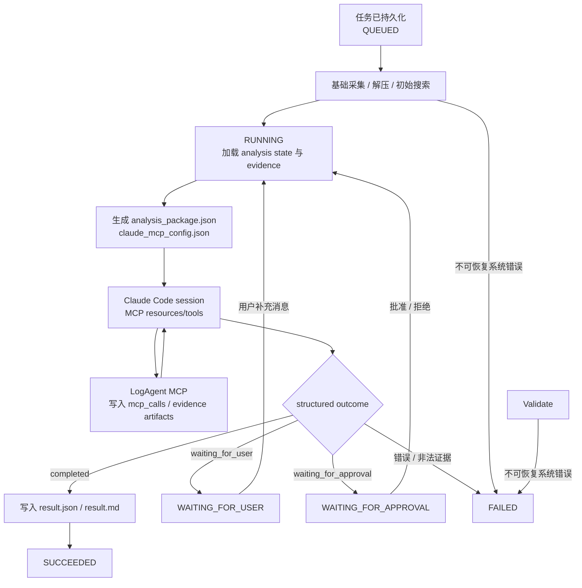

# LogAgent MVP Spec

## 目标

LogAgent 把用户问题、日志包、元数据、工具结果、测试流水线或测试环境采集结果转换成可审计证据链。Server 负责证据采集、领域适配、状态、MCP 能力和执行边界；Claude Code 负责通用推理、代码上下文分析和结构化结果生成。

当前产品方向是诊断证据工作台和 Claude Code 的领域诊断增强层，不替代 Claude Code，而是通过 LogAgent MCP server 提供日志、Metadata、System Context、Domain Tools、Case 和审批能力，并在 openGemini/InfluxDB、Cassandra、RocksDB 等领域提供专项增强。

第一阶段目标是跑通：

```text
WEBUI 创建/选择 Session，填写问题，可选 Chrome 下载或 WEBUI 上传
  -> Native Agent 或 Server 上传接口
  -> 可选附加 upload 到 Session
  -> 用户显式启动一次分析 run
  -> Server task workspace 快照
  -> 解压与 manifest
  -> grep 证据
  -> WEBUI 查看证据
```

## 技术原则

新实现优先使用 Rust，语言优先级：

```text
Rust -> C/C++ -> Go/Python/Java 等
```

已有编译工具可复用，不强制重写。外部工具统一通过白名单配置和 Tool Runner 调用。

## 组件和内部能力边界

当前可运行组件：

| 组件 | Spec |
|------|------|
| Chrome Extension | [chrome-extension/SPEC.md](./chrome-extension/SPEC.md) |
| Native Agent | [native-agent/SPEC.md](./native-agent/SPEC.md) |
| Server | [server/SPEC.md](./server/SPEC.md) |
| WebUI | [webui/SPEC.md](./webui/SPEC.md) |
| Testing | [testing/SPEC.md](./testing/SPEC.md) |

Server 内部能力目前不拆独立目录或 crate，设计文档统一归档在 `docs/modules/`：

| 能力 | Spec |
|------|------|
| Claude Code Session Runner | [docs/modules/agent-backends/SPEC.md](./docs/modules/agent-backends/SPEC.md) |
| Log Analyzer | [docs/modules/log-analyzer/SPEC.md](./docs/modules/log-analyzer/SPEC.md) |
| Tool Runner | [docs/modules/tool-runner/SPEC.md](./docs/modules/tool-runner/SPEC.md) |
| Domain Adapters | [docs/modules/domain-adapters/SPEC.md](./docs/modules/domain-adapters/SPEC.md) |
| Code Evidence | [docs/modules/code-evidence/SPEC.md](./docs/modules/code-evidence/SPEC.md) |
| Environment Collector | [docs/modules/environment-collector/SPEC.md](./docs/modules/environment-collector/SPEC.md) |
| Metadata | [docs/modules/metadata/SPEC.md](./docs/modules/metadata/SPEC.md) |
| System Context | [docs/modules/system-context/SPEC.md](./docs/modules/system-context/SPEC.md) |
| Analysis Agent | [docs/modules/analysis-agent/SPEC.md](./docs/modules/analysis-agent/SPEC.md) |
| LLM Gateway | [docs/modules/llm-gateway/SPEC.md](./docs/modules/llm-gateway/SPEC.md) |
| Memory / Case Store compatibility | [docs/modules/case-store/SPEC.md](./docs/modules/case-store/SPEC.md) |
| Memory | [docs/modules/memory/SPEC.md](./docs/modules/memory/SPEC.md) |
| Config | [docs/modules/config/SPEC.md](./docs/modules/config/SPEC.md) |
| Interfaces | [docs/modules/interfaces/SPEC.md](./docs/modules/interfaces/SPEC.md) |
| Deployment | [docs/modules/deployment/SPEC.md](./docs/modules/deployment/SPEC.md) |
| Security | [docs/modules/security/SPEC.md](./docs/modules/security/SPEC.md) |
| Roadmap | [docs/modules/roadmap/SPEC.md](./docs/modules/roadmap/SPEC.md) |

## 核心数据流

上传来源：

```text
Chrome Extension -> Native Agent -> Server upload API -> Session uploads
WEBUI -> Server upload API -> Session uploads
Question-only Session -> explicit analysis run -> Task pipeline
Session uploads -> explicit analysis run -> Task pipeline
```

测试环境来源：

```text
WEBUI/Server task -> Environment Collector -> Server workspace -> Task pipeline
```

证据处理：

```text
raw file -> extracted files -> initial evidence
  -> system_context.json background resources
  -> domain adapter evidence summary
  -> Analysis Orchestrator context
  -> Claude MCP config
  -> Claude Code session uses MCP resources/tools
  -> Server persists MCP evidence / waiting state / audit
  -> structured Claude outcome
  -> final result
```

Analysis Orchestrator 使用任务级持久化上下文：

```text
analysis_state.json
analysis_events.jsonl
system_context.json
result.json
result.md
```

Claude Code 通过 LogAgent MCP tools 请求领域能力并返回结构化 session outcome。Server 是日志搜索、领域工具、代码检索和远程采集的唯一执行者。

## 调查循环图



状态和阶段分离：

- 稳定状态：`QUEUED`、`RUNNING`、`WAITING_FOR_USER`、`WAITING_FOR_APPROVAL`、`SUCCEEDED`、`FAILED`。
- 执行阶段：`COLLECT`、`EXTRACT`、`SEARCH_LOGS`、`RUN_TOOL`、`COLLECT_CODE`、`PLAN_ANALYSIS`、`EXECUTE_ACTION`、`GENERATE_RESULT` 等。
- 预算耗尽或证据不足属于可解释的分析终止，通常生成低置信度结果并进入 `SUCCEEDED`；只有不可恢复系统错误进入 `FAILED`。

## 当前已实现

- Chrome Extension 识别下载完成并调用 Native Agent。
- Native Agent 接收本地导入请求，校验路径、后缀和大小，上传 Server。
- Server 支持 multipart 上传、分片上传、任务创建、任务产物读取。
- Server 支持 Log Analysis Session：创建/列表/读取/草稿更新、附加/移除上传、按 Session 创建多次 task run、统一 timeline。
- Log Analysis Session 支持不上传日志直接启动分析；Task snapshot 的 `uploadIds` 和 `inputs` 为空，pipeline 仍生成 `session_text_input.json`、空 `manifest.json` / `grep_results.json` 并进入 Analysis Orchestrator。
- 成功 Log Analysis task 持久化 `alias`；alias 由最终结果生成后的独立 LLM Gateway 调用产生，失败时回退到最终 summary/question 的短标题，且该调用不进入 timeline。
- Log Analysis task schema 强制带 `sessionId`；旧的无 Session task 不再兼容展示。
- Server 持久化任务并在后台执行，支持重启恢复。
- Upload session 持久化并支持重启续传。
- Metadata 接入 task context，写入 `metadata_context.json` 并进入 LLM Prompt。
- System Context 接入 task context，支持 Prompt Pack、架构文档、Runbook、工具能力说明和 Metadata adapter 资源管理；创建 Log Analysis run 时写入 `system_context.json` 并进入 LLM Prompt 背景区。
- Claude Code Session Runner 已支持 `claude_code` 配置、`analysisMode=diagnose|code_investigation|fix`、Settings 摘要和 dry-run 诊断；旧 `agent_backends` 配置不再作为运行入口。
- Domain Adapters 第一阶段已内置 `opengemini_influxdb` active adapter，以及 `cassandra`、`rocksdb` skeleton adapter，并通过 Settings API 暴露摘要。
- Executor 按持久化 phase 调度并从中断阶段恢复，公共 Action/Evidence 契约已落地。
- Tool Runner MVP 支持白名单工具配置、规则版多输入工具 action、`RUN_TOOL` phase、Claude MCP `logagent.run_domain_tool`、`tool_results` artifact 和 JSON stdout summary/findings 解析；真实 `influxql-analyzer` Report stdout 已适配为结构化 findings 并通过本地 smoke，当前本机路径为 `/usr/bin/influxql-analyzer`。
- Tools API MVP 支持 `tool_run` 任务、工具目录、手动创建工具运行、运行状态轮询、结果/artifact 查询；`/api/tasks` 默认只返回日志分析任务，工具运行通过 `/api/tools/runs` 查询。
- `pprof_analyzer` 已作为第一个 Tools 插件接入，复用上传、TaskStore、workspace、后台 Executor 和 `tool_results` 目录，通过配置中的 Go 可执行文件运行 `go tool pprof`，生成 top/tree/raw 结果并解析 top 表格。
- 根目录 `deploy/` 提供 runtime 部署模板，包含 `.env.example`、`logagent.example.yaml`、`logagentctl.sh`、`rebuild-install.sh` 和 README；脚本可自动加载 runtime `deploy/.env`。
- Analysis State Store MVP 已写入 `analysis_state.json` / `analysis_events.jsonl`，并提供 `GET /api/tasks/:task_id/analysis` 读取当前快照和事件流；`PLAN_ANALYSIS` 的 Claude Code session 调用会记录 callId、attempt、session artifact 和完成事件。
- Log Analysis run 会在 `PLAN_ANALYSIS` 前刷新 `analysis_package.json` 和 `claude_mcp_config.json`，随后调用 Claude Code CLI 并写出 `claude_session.json`、`mcp_calls.jsonl` 和真实 `agent_response.json`。`agent_response.json` 现在表示 Claude Code session response，包含 `runtimeStatus`、`claudeSessionId`、`analysisMode`、`permissionProfile`、`structuredOutput`、usage/cost、耗时、MCP call 路径和错误。
- Analysis Orchestrator 已支持 `ask_user` 进入 `WAITING_FOR_USER`，通过 `POST /api/tasks/:task_id/messages` 接收回答后恢复同一任务。
- Analysis Orchestrator 已支持 Claude MCP `request_approval` 进入 `WAITING_FOR_APPROVAL`，通过 `POST /api/tasks/:task_id/actions/:action_id/decision` 批准或拒绝后恢复；真实 SSH/SCP 采集后续接入 Environment Collector。
- Memory MVP 已支持 `memoryType=case`、兼容 Case schema v2 API、成功任务人工确认、LLM-assisted 文本导入手工 Case、SQLite/FTS 本地索引、legacy JSON 启动导入、关键词 fallback 召回和禁用。
- 最终结果 evidence refs 支持历史 Case canonical 引用 `case_context.json#cases/<index>`；真实模型输出 `case_<id>` 或“历史案例 case_<id>”时会按当前 task 的 `case_context.json` 规范化。
- Log Analyzer 支持 `.log`、`.txt`、`.zip`、`.tar.gz`、`.tgz`、`.tar`。
- LLM Gateway 支持 stub、OpenAI-compatible Chat Completions 和预留 binary provider；当前保留给 Case import、alias 生成和非 Agent Loop 的辅助结构化任务。Log Analysis 的 `PLAN_ANALYSIS` 不再调用 LLM Gateway 决策入口。
- WEBUI 使用 React + Vite，Log Analysis 已改为 Session-first，默认进入 Log Analysis，顶部导航顺序为 Log Analysis、Memory、System Context、Tools、Settings；支持 Session history、草稿自动保存、System Context 选择、上传附加、同一 Session 多次 run、统一 evidence timeline、Task execution 摘要、Claude Code session / MCP calls 展示、单次 LLM 结果、顶部 LLM debug 开关、Memory 管理页面、System Context 资源管理、完整 Metadata 拓扑、Tools 工具集页面、Settings Claude Code/LLM/Domain Adapter 诊断、Diagnostics 和 Raw JSON。

## 待实现能力

- 围绕“诊断证据工作台 + Claude Code MCP 增强层 + Domain Adapter”补齐完整产品闭环。
- 完善 Claude Code session runner 的用量审计、错误分类、resume 和模式权限。
- 将更多工具按 Tools 插件描述接入，并让 MCP `logagent.run_domain_tool` 复用同一个工具 registry。
- 接入真实 `flux_query_analyzer` 工具路径和规则。
- 扩展 `influxql_analyzer` compare mode delta 字段映射。
- Analysis Orchestrator 更完整的用户追问/审批策略、恢复幂等审计和产品化交互。
- LLM Gateway 补齐用量审计、Provider request id 和稳定结构化协议。
- Memory embedding/vector 召回和自动注入 analysis evidence bundle。
- Cassandra 和 RocksDB domain adapter 的日志模式、工具和 fixture。
- 根据用户输入的软件版本切换代码仓分支并收集证据。
- 测试环境通过 SSH/SCP 采集日志和运行环境信息。

## 全局验收

- 本地 `cargo fmt --check`、`cargo check`、`cargo test` 通过。
- WEBUI 能完成上传、创建任务、读取证据。
- API 受 API Key 保护，密钥不写入日志或产物。
- 压缩包解压不能逃逸 workspace。
- Claude Code 的 MCP tool 调用和最终 evidence refs 必须经过 schema、白名单、预算和审批校验。
- 任务能从 `WAITING_FOR_USER` / `WAITING_FOR_APPROVAL` 接收输入并恢复。
- 后续每个功能变更必须同步更新对应模块 `README.md` 和 `SPEC.md`。
