# LogAgent Architecture Review

Review date: 2026-06-14

> **Historical snapshot.** This review describes the pre-pivot analysis-agent
> architecture (Sessions, Claude Code task-scoped MCP, analysis_state, LLM
> gateway, domain adapters). Phase 5 deleted that surface; see `PROGRESS.md`
> for the current Tools/MCP-workbench architecture.

This review is based on the current repository implementation, not only the planning documents. It covers the root `README.md`, `SPEC.md`, `PROGRESS.md`, module roadmap, component README/SPEC files, and the current server, webui, native-agent, log-analyzer, metadata, tool-runner and analysis-loop code.

## 1. Current Real Architecture

The current product has two user-facing entry modes:

- Main product loop: WebUI Analyze / Chrome Extension / Native Agent create uploads and Sessions, then Server creates task workspaces and invokes Claude Code through a task-scoped stdio MCP server.
- Advanced personal knowledge loop: protected read-only HTTP MCP exposes shared knowledge such as Skills, Metadata, Cases and Tools catalog, without touching task workspaces.

```mermaid
flowchart TB
  subgraph Inputs
    CE[Chrome Extension]
    NA[Native Agent<br/>127.0.0.1 Axum]
    W[WebUI<br/>React + Vite + Tailwind]
    U[Manual Upload / Question]
    PCC[Personal Claude Code<br/>read-only HTTP MCP client]
  end

  CE -->|download complete + user click| NA
  NA -->|POST /api/uploads or chunk upload| S
  NA -->|create/attach Session| S
  W -->|protected /api/*| S
  U --> W
  PCC -->|POST /api/mcp/readonly| RMCP

  subgraph Server[logagent-server Rust/Axum]
    HTTP[HTTP Router<br/>server/src/http/mod.rs]
    S[AppState<br/>server/src/app.rs]
    Exec[TaskExecutor<br/>pipeline/executor.rs]
    Uploads[UploadStore]
    Tasks[TaskStore]
    Sessions[AnalysisSessionStore]
    Metadata[MetadataStore]
    Memory[Memory / CaseStore]
    Skills[SkillRegistry]
    SysCtx[SystemContextStore]
    LLM[LLM Gateway<br/>case import / alias / compatibility]
    Agent[Claude Code Session Runner<br/>services/agent_backend.rs]
    ToolRunner[Generic ToolRunner<br/>services/tool_runner.rs]
    ToolsAPI[Manual Tools plugins<br/>services/tools.rs]
    LogAnalyzer[Log Analyzer<br/>services/log_analyzer.rs]
    Domain[DomainAdapterRegistry]
    RMCP[Read-only HTTP MCP<br/>http/mcp_readonly.rs]
  end

  HTTP --> S
  S --> Uploads
  S --> Tasks
  S --> Sessions
  S --> Metadata
  S --> Memory
  S --> Skills
  S --> SysCtx
  S --> LLM
  S --> Agent
  S --> ToolRunner
  S --> ToolsAPI
  S --> Domain
  HTTP --> RMCP

  subgraph Workspace[Task Workspace<br/>data_dir/workspaces/task_xxx]
    Raw[raw/]
    Extracted[extracted/]
    Manifest[manifest.json]
    Grep[grep_results.json]
    MetaCtx[metadata_context.json]
    SystemCtx[system_context.json]
    CaseCtx[case_context.json]
    AnalysisState[analysis_state.json<br/>analysis_events.jsonl]
    AgentPkg[analysis_package.json<br/>claude_prompt.md<br/>claude_mcp_config.json]
    AgentRuntime[claude_session.json<br/>agent_response.json<br/>mcp_calls.jsonl]
    ToolArtifacts[tool_results/...]
    Slices[log_slices/...<br/>metadata_slices/...<br/>skill_references/...]
    Result[result.json<br/>result.md]
  end

  Exec -->|EXTRACT| LogAnalyzer
  LogAnalyzer --> Extracted
  LogAnalyzer --> Manifest
  Exec -->|SEARCH_LOGS| Grep
  Exec -->|RUN_TOOL rules| ToolRunner
  ToolRunner --> ToolArtifacts
  Exec -->|PLAN_ANALYSIS| AgentPkg
  Exec --> Agent
  Agent -->|spawn claude --print --mcp-config| Claude[Claude Code CLI]
  Claude -->|stdio JSON-RPC| TMCP[Task LogAgent MCP<br/>server/src/mcp.rs]
  TMCP -->|resources/read| Workspace
  TMCP -->|search_logs| Grep
  TMCP -->|get_log_slice| Slices
  TMCP -->|run_domain_tool| ToolRunner
  TMCP -->|recall_cases| Memory
  TMCP -->|query_metadata| Slices
  TMCP -->|get_skill_reference| Slices
  TMCP -->|request_user_input / approval| AgentRuntime
  Agent --> AgentRuntime
  Exec -->|completed| Result
  Exec -->|waiting| Tasks
  Exec --> Sessions

  ToolsAPI -->|tool_run taskKind| ToolArtifacts
  RMCP --> Skills
  RMCP --> Metadata
  RMCP --> Memory
  RMCP --> Domain
  RMCP -->|catalog only| ToolRunner
```

## 2. Implemented Capabilities By Module

### chrome-extension

- Manifest V3 extension implemented.
- Listens to Chrome download completion through `chrome.downloads.onChanged`.
- Matches configured URL prefixes and file suffixes.
- Shows user notification and, on click, calls Native Agent `POST /imports`.
- Options page supports Agent URL, URL prefixes and suffixes.

Evidence:

- `chrome-extension/README.md`
- `chrome-extension/SPEC.md`

### native-agent

- Local Rust/Axum service.
- Public local endpoints: `GET /health`, `POST /imports`, `GET/PUT/DELETE /workspace/current`.
- Validates imported local files by canonical path, regular-file check, suffix, max size and optional `allowed_dirs`.
- Uploads small files by multipart and large files by sequential chunk upload.
- Uses Server API key from environment and can attach imported files to the active Session.

Evidence:

- `native-agent/src/main.rs::import_file`
- `native-agent/src/main.rs::validate_import`
- `native-agent/src/main.rs::upload_file`
- `native-agent/src/main.rs::upload_file_chunked`
- `native-agent/src/main.rs::load_config`

### server core

- Single Rust/Axum binary with shared `AppState`.
- API key middleware protects `/api/*`; `/health` and static WebUI are public.
- Serves `webui/out` through `ServeDir`.
- Persistent stores for uploads, tasks, sessions, metadata, system context, skills, cases and case imports.
- Startup recovery scans task records and re-enqueues incomplete queued/running tasks.
- Background executor uses persisted task phases.

Evidence:

- `server/src/app.rs::AppState`
- `server/src/app.rs::new`
- `server/src/app.rs::recover_tasks`
- `server/src/http/mod.rs::router`
- `server/src/main.rs::main`
- `server/src/stores/task_store.rs::recover_incomplete`

### uploads and sessions

- Small multipart upload, multipart batch upload and chunked upload are implemented.
- Upload Store persists JSON records and reconciles incomplete chunked uploads.
- Session-first Analyze flow persists drafts, attached upload IDs, active task, task history and timeline events.
- Each analysis run creates a new `taskKind=log_analysis` task workspace snapshot.

Evidence:

- `server/src/http/uploads.rs`
- `server/src/stores/upload_store.rs`
- `server/src/http/sessions.rs::create_session`
- `server/src/http/sessions.rs::create_session_task`
- `server/src/http/sessions.rs::session_timeline`
- `server/src/stores/session_store.rs::add_task_run`
- `server/src/stores/session_store.rs::sync_task_status`

### log-analyzer

- Implemented as an internal Server module.
- Supports `.log`, `.txt`, `.zip`, `.tar.gz`, `.tgz` and `.tar`.
- `.tar.gz` and `.tgz` fallback to plain tar when gzip tar decoding fails.
- Creates `manifest.json`.
- Creates `grep_results.json` through a simple configured keyword scan.
- Supports text-only Session analysis by generating an empty manifest/grep artifact and separate `session_text_input.json`.

Evidence:

- `server/src/services/log_analyzer.rs::extract_upload`
- `server/src/services/log_analyzer.rs::run_simple_grep`
- `server/src/services/log_analyzer.rs::grep_dir`
- `server/src/services/log_analyzer.rs::grep_file`
- `server/src/pipeline/mod.rs::extract_task`
- `server/src/pipeline/mod.rs::search_task_with_settings`

### metadata

- JSON/YAML/openGemini metadata import and preview are implemented.
- openGemini `/getdata` parsing includes Meta/Data/SQL nodes, databases, retention policies, measurements, shard groups, shards, indexes and partition views.
- Instance-centric model is implemented; `instanceId` is the main user key, while source `ClusterID` is preserved as a label.
- Task creation resolves `instanceId` / `nodeId` into `metadata_context.json`.
- Task MCP exposes metadata outline and bounded slices through `logagent.query_metadata`.
- Read-only HTTP MCP exposes metadata instance list and snapshots.

Evidence:

- `server/src/services/metadata.rs::MetadataStore`
- `server/src/services/metadata.rs::resolve_task_context`
- `server/src/services/metadata.rs::confirm_import`
- `server/src/services/metadata.rs::fetch_metadata_content`
- `server/src/mcp.rs::query_metadata_tool`
- `server/src/http/mcp_readonly.rs`

### tool-runner and tools

- Generic Tool Runner can execute configured whitelist tools using argument templates and no shell.
- Supports fixed path or `path_env`, timeout, output truncation, stdout/stderr/result artifacts, idempotent artifact reuse and structured findings extraction.
- Rule-based tool action selection uses manifest file patterns and grep keywords.
- Real InfluxQL analyzer report/compare output parsing is implemented.
- Manual WebUI Tools path exists through `taskKind=tool_run`; current plugin is `pprof_analyzer`, implemented by calling `go tool pprof`.
- Tools catalog is exposed through read-only HTTP MCP and `tools.zip` export.

Evidence:

- `server/src/services/tool_runner.rs::rule_based_actions`
- `server/src/services/tool_runner.rs::execute`
- `server/src/services/tool_runner.rs::parse_tool_output_value`
- `server/src/http/tools.rs::create_tool_run`
- `server/src/services/tools.rs::descriptors`
- `server/src/services/tools.rs::run_tool_task`
- `server/src/services/tools.rs::run_pprof_task`

### analysis loop and Claude Code runner

- Running analysis path is now `PLAN_ANALYSIS` -> Claude Code Session Runner, not the old self-built action loop.
- Executor writes `analysis_package.json`, `claude_prompt.md`, `claude_mcp_config.json`, `claude_session.json`, `agent_response.json` and `mcp_calls.jsonl`.
- Claude Code is invoked with `--print --output-format json --json-schema --mcp-config --strict-mcp-config`; short prompt is passed through stdin, full context is read through MCP resources.
- Supports `completed`, `waiting_for_user` and `waiting_for_approval`.
- User message and approval APIs resume waiting tasks.
- Final answer evidence refs are validated before success.

Evidence:

- `server/src/pipeline/executor.rs::dispatch_phase`
- `server/src/pipeline/executor.rs::plan_analysis_phase`
- `server/src/pipeline/executor.rs::wait_for_agent_action`
- `server/src/http/tasks.rs::post_task_message`
- `server/src/http/tasks.rs::post_action_decision`
- `server/src/services/agent_backend.rs::decide_next`
- `server/src/services/agent_backend.rs::run_claude_code_command`
- `server/src/services/llm_gateway.rs::validate_final_answer_with_evidence`

### task stdio MCP

- Implements task-scoped JSON-RPC stdio MCP.
- Resources include task summary, artifact index, analysis package, manifest, grep results, metadata outline, system context, case context and tool results.
- Tools include log search, log slice, domain tool, case recall, metadata topology/query, skill reference, user input request and approval request.
- MCP calls append to `mcp_calls.jsonl`.

Evidence:

- `server/src/main.rs::main` MCP subcommand branch
- `server/src/mcp.rs::run_stdio`
- `server/src/mcp.rs::read_resource_result`
- `server/src/mcp.rs::call_tool`
- `server/src/mcp.rs::log_mcp_call`

### read-only HTTP MCP and exports

- Protected `POST /api/mcp/readonly` supports read-only MCP operations.
- Exposes Skills, Metadata, recent Cases, Tools catalog and Domain Adapters.
- Does not read task workspace, create or resume Sessions, upload files, approve actions or execute Tool Runner.
- Exports `skills.zip` and `tools.zip`.

Evidence:

- `server/src/http/mod.rs::router`
- `server/src/http/mcp_readonly.rs`
- `server/src/http/exports.rs`

### memory and case store

- Case Store facade backed by SQLite Memory store plus legacy JSON sync.
- Supports task-confirmed Cases, manual Cases and LLM-assisted text import drafts.
- Case search uses SQLite FTS/BM25 plus keyword fallback.
- New tasks write `case_context.json`.
- Final answers may cite `case_context.json#cases/<index>`.

Evidence:

- `server/src/stores/memory_store.rs`
- `server/src/stores/case_store.rs`
- `server/src/stores/case_import_store.rs`
- `server/src/http/cases.rs`
- `server/src/services/llm_gateway.rs::normalize_evidence_ref`

### skills and system context

- Skill registry reads Codex-compatible `SKILL.md` plus optional LogAgent `logagent.json`.
- Initial Skills exist for openGemini diagnosis, InfluxQL analysis and pprof diagnosis.
- Task creation snapshots selected/auto-matched Skills and Metadata adapter summaries into `system_context.json`.
- MCP can read declared Skill references into `skill_references/**` background artifacts.
- System Context and Skill references are explicitly disallowed as final root-cause evidence.

Evidence:

- `server/src/services/skill_registry.rs`
- `server/src/stores/system_context_store.rs`
- `server/src/http/skills.rs`
- `server/src/mcp.rs::get_skill_reference_tool`
- `server/src/services/llm_gateway.rs::is_background_only_ref`

### webui

- React 18 + Vite + TypeScript + Tailwind application.
- Main navigation includes Analyze, Memory, System Context, Tools and Settings.
- Analyze is Session-first and supports question-only analysis, upload attach, task polling, timeline, waiting user input, approval decision, result display and Case confirmation.
- Memory page supports Case search, manual entry/import and edit/enable controls.
- System Context page exposes Skills and Metadata.
- Tools page supports pprof upload and result display.
- Settings page exposes LLM, Claude Code, Domain Adapter and personal read-only MCP/export information.

Evidence:

- `webui/package.json`
- `webui/vite.config.ts`
- `webui/src/OperationsView.tsx`
- `webui/src/CasesView.tsx`
- `webui/src/SystemContextView.tsx`
- `webui/src/ToolsView.tsx`
- `webui/src/SettingsView.tsx`
- `webui/src/metadata/MetadataDashboard.tsx`

## 3. Gap Analysis Against README / SPEC / Roadmap

### Architecture direction is mostly aligned, but some old and new contracts coexist

Root docs now correctly describe LogAgent as a diagnostic evidence workbench plus Claude Code domain enhancement layer. The actual running path matches that direction: `PLAN_ANALYSIS` invokes Claude Code and exposes task capabilities through MCP.

The gap is that several old self-built agent-loop concepts still exist as compatibility code, tests or docs:

- `LLM Gateway` still contains old action-decision retry prompt helpers that explicitly say not to output `collect_code_evidence`.
- `TaskPhase::GenerateResult` remains as a compatibility path even though current `PLAN_ANALYSIS` is the main path.
- `ActionKind::CollectCodeEvidence` exists, but no Code Evidence provider exists.

Evidence:

- `server/src/services/llm_gateway.rs::build_action_decision_retry_prompt`
- `server/src/domain/contracts.rs::ActionKind`
- `server/src/domain/models.rs::TaskPhase`
- `server/src/pipeline/executor.rs::dispatch_phase`

### Log Analyzer planned artifacts are not fully implemented

Module docs still describe richer planned outputs:

- `error_summary.json`
- `contexts.jsonl`
- `log_searches/<action_id>.json`

Actual implementation writes:

- `manifest.json`
- `grep_results.json`
- optional `log_slices/**` from MCP

`logagent.search_logs` currently rewrites `grep_results.json` instead of creating stable `log_searches/<action_id>.json`.

Evidence:

- `docs/modules/log-analyzer/README.md`
- `docs/modules/log-analyzer/SPEC.md`
- `server/src/pipeline/mod.rs::search_task_with_settings`
- `server/src/mcp.rs::search_logs_tool`

### Tool Runner is implemented, but the product has two tool execution registries

The Tool Runner docs say Tool Runner should cover initial rules, Tools page manual runs and MCP `run_domain_tool`. In code:

- Generic analyzer tools use `services/tool_runner.rs`.
- Manual WebUI pprof uses separate plugin code in `services/tools.rs`.
- Only pprof appears in `services/tools.rs::descriptors`.

This works for MVP pprof, but it makes future Flux/InfluxQL/manual tool extensions duplicate schema, validation and result APIs.

Evidence:

- `docs/modules/tool-runner/README.md`
- `server/src/services/tool_runner.rs::ToolRunner`
- `server/src/services/tools.rs::descriptors`
- `server/src/services/tools.rs::run_tool_task`
- `server/src/http/tools.rs::create_tool_run`

### Analysis Agent budget and termination are partially implemented

Docs mention:

- max rounds
- max LLM calls
- max actions
- max repeated action fingerprints
- future token/runtime/per-round question budgets

Code currently enforces only rounds and LLM calls in the running executor.

Evidence:

- `docs/modules/analysis-agent/README.md`
- `server/src/support/config.rs::AnalysisSettings`
- `server/src/pipeline/executor.rs::analysis_budget_exhausted`

### Environment Collector is still a mock after approval

Docs describe SSH/SCP collection from configured test environment nodes. Actual approved environment actions write a mock artifact.

Evidence:

- `docs/modules/environment-collector/README.md`
- `docs/modules/environment-collector/SPEC.md`
- `server/src/pipeline/executor.rs::wait_for_agent_action`
- `server/src/http/tasks.rs::write_mock_environment_evidence`

### Code Evidence is not implemented

Docs describe version-to-ref mapping, read-only worktree/cache and code search evidence. The repository has no corresponding service implementation or config parser for `code_repos` / `code_evidence`.

Evidence:

- `docs/modules/code-evidence/README.md`
- `docs/modules/code-evidence/SPEC.md`
- `server/src/domain/contracts.rs::ActionKind::CollectCodeEvidence`
- `server/src/services/llm_gateway.rs::build_action_decision_retry_prompt`

### Domain Adapters are currently registry metadata only

Docs frame Domain Adapters as evidence summarizers and tool/context recommenders. Actual implementation exposes adapter summaries through Settings and read-only MCP, but does not affect task creation, tool selection, Skill matching or analysis package construction beyond the static built-in registry.

Evidence:

- `docs/modules/domain-adapters/README.md`
- `server/src/app.rs::AppState`
- `server/src/services/domain_adapters.rs`
- `server/src/http/settings.rs`

### Memory / Case Store lacks embedding recall

Docs intentionally mark embedding/vector recall as later. Actual Memory uses SQLite FTS/BM25 plus keyword scoring. This is acceptable for current MVP, but below roadmap target for semantic recall.

Evidence:

- `docs/modules/case-store/README.md`
- `docs/modules/case-store/SPEC.md`
- `server/src/stores/memory_store.rs`
- `server/src/stores/case_store.rs`

### Metadata CSV and safe remote fetch are incomplete

Docs mark CSV import as not implemented. More importantly, Server-side metadata URL fetch exists but has no host allowlist, timeout, response size cap or private-network guard.

Evidence:

- `docs/modules/metadata/README.md`
- `server/src/services/metadata.rs::fetch_metadata_content`

### WebUI docs are aligned with Vite; injected AGENTS note is stale on Next.js

The repository WebUI docs and actual package use React + Vite + Tailwind. The user-provided AGENTS note mentions React + Next.js. For implementation, the repo is the source of truth.

Evidence:

- `webui/package.json`
- `webui/vite.config.ts`
- `webui/README.md`
- `webui/SPEC.md`

## 4. Top 10 Architecture Problems Affecting Extension

### 1. AppState and large modules concentrate too many responsibilities

Code evidence:

- `server/src/app.rs::AppState` holds config, all stores, executor, LLM, Claude runner registry, domain adapters and Tool Runner.
- `server/src/pipeline/executor.rs::dispatch_phase` owns all task phase branching.
- Large files show high coupling pressure:
  - `server/src/mcp.rs`: 1296 lines
  - `server/src/http/tasks.rs`: 2370 lines
  - `server/src/services/llm_gateway.rs`: 3585 lines
  - `server/src/services/metadata.rs`: 3099 lines
  - `server/src/services/tool_runner.rs`: 1497 lines
  - `server/src/pipeline/executor.rs`: 1218 lines
  - `webui/src/OperationsView.tsx`: 1080 lines
  - `webui/src/metadata/MetadataDashboard.tsx`: 1012 lines

Impact:

- Code Evidence, Environment Collector and richer Domain Adapters will keep pushing logic into already large modules.
- Testing and review become harder because feature work often touches central files.
- A bug in MCP/artifact/evidence behavior can spread across analysis, WebUI and final validation.

Recommended direction:

- Keep the single binary for MVP, but split internal boundaries now.
- Extract an `EvidenceArtifactRegistry` / `EvidenceRefRegistry` from MCP and LLM Gateway.
- Extract task phase handlers into separate modules under `pipeline/phases`.
- Split `http/tasks.rs` into task creation, messages/approvals, artifacts/result and analysis read APIs.
- Split `mcp.rs` into resources, tools, schemas and audit logging.

MVP must handle?

- Partially yes. Full service decomposition is not required, but evidence/MCP/artifact boundaries should be split before adding Code Evidence and Environment Collector.

### 2. TaskRecord is an untyped union for multiple task kinds

Code evidence:

- `server/src/domain/models.rs::TaskRecord` contains fields for log analysis and tool runs in one struct: `session_id`, `tool_id`, `tool_params`, `tool_result_path`, metadata fields, result fields and analysis mode.
- `server/src/domain/models.rs::TaskKind` currently supports only `LogAnalysis` and `ToolRun`.
- `server/src/http/tools.rs::create_tool_run` creates `TaskRecord` with many analysis-only fields set to `None`.
- `server/src/stores/task_store.rs::validate_loaded_task` enforces only a small subset of invariants, such as log analysis requiring `sessionId`.

Impact:

- New task kinds such as code investigation, fix, environment collection or batch tool comparison will increase optional-field ambiguity.
- Invalid states are prevented by scattered runtime checks instead of type structure.
- Artifact APIs need more branching as each task kind adds its own result shape.

Recommended direction:

- Introduce a task payload enum, for example `TaskPayload::LogAnalysis`, `TaskPayload::ToolRun`, later `TaskPayload::CodeInvestigation`.
- Keep the JSON schema versioned and provide migration/deserialization compatibility.
- Move task-kind-specific fields out of the common top-level record.
- Make artifact/result APIs dispatch through task-kind handlers.

MVP must handle?

- Yes before adding new task kinds. If only current log analysis and pprof tool run remain, this can wait briefly, but it is a blocker for Code Evidence/fix mode expansion.

### 3. Evidence refs returned by MCP do not match final-answer validation and UI navigation

Code evidence:

- `server/src/mcp.rs::get_log_slice_tool` writes `log_slices/<id>.json` and returns `log_slices/<id>.json#lines`.
- `server/src/mcp.rs::run_domain_tool` returns a bare `artifact.artifact_path`, not the canonical finding refs accepted by final validation.
- `server/src/mcp.rs::recall_cases_tool` returns `case_recall/<id>.json#cases/<index>`.
- `server/src/mcp.rs::get_skill_reference_tool` returns `evidenceRefs` even though it also marks `finalEvidenceAllowed=false`.
- `server/src/services/llm_gateway.rs::normalize_evidence_ref` accepts only `session_text_input.json#question`, `grep_results.json#matches/<index>`, `case_context.json#cases/<index>` and `tool_results/<action_id>/result.json#findings/<index>`.
- `webui/src/OperationsView.tsx::scrollToEvidence` supports session text, grep matches and case context, but not tool finding refs.

Impact:

- Claude Code can be shown or returned refs that final validation rejects.
- Tasks can fail at the final answer stage despite using artifacts created by Server MCP tools.
- Users cannot navigate to some valid evidence refs in the WebUI, especially tool findings.
- Evidence semantics become unclear: some returned `evidenceRefs` are background refs, not final refs.

Recommended direction:

- Define a central evidence ref registry with explicit classes:
  - final evidence
  - background context
  - audit artifact
  - pending/waiting marker
- Make every MCP tool response use `finalEvidenceRefs` and `backgroundRefs` separately.
- For `run_domain_tool`, return canonical `tool_results/<action_id>/result.json#findings/<index>` refs when findings exist.
- For `get_log_slice`, decide whether slices can become final evidence. If yes, add validation and UI support; if no, return only background refs.
- Add WebUI jump support for tool finding refs and any newly accepted log slice refs.

MVP must handle?

- Yes. This directly affects correctness of Claude final answers and user trust in cited evidence.

### 4. `search_logs` rewrites `grep_results.json`, making evidence mutable

Code evidence:

- `server/src/mcp.rs::search_logs_tool` calls `search_task_with_settings`, then reads the same `grep_results.json`.
- `server/src/pipeline/mod.rs::search_task_with_settings` writes directly to `workspace/grep_results.json`.
- `server/src/stores/analysis_state.rs::record_log_search` appends an event, but the artifact path remains `grep_results.json`.

Impact:

- Initial grep evidence and subsequent searches share one mutable artifact path.
- If Claude cites a match from an earlier search after a later search rewrites the file, the same `grep_results.json#matches/<index>` selector can point to different content.
- This undermines auditability and final evidence stability.

Recommended direction:

- Preserve initial `grep_results.json` as initial scan evidence.
- Write subsequent MCP searches to `log_searches/<action_id>.json`.
- Include canonical refs such as `log_searches/<action_id>.json#matches/<index>`.
- Add compatibility mapping only for old tasks if necessary.
- Update `analysis_package.json`, final validation and WebUI evidence navigation.

MVP must handle?

- Yes. Stable evidence refs are foundational for the product.

### 5. Analysis budget config is not fully enforced

Code evidence:

- `server/src/support/config.rs::AnalysisSettings` includes `max_actions` and `max_repeated_action_fingerprints`, both marked with `#[allow(dead_code)]`.
- `server/src/pipeline/executor.rs::analysis_budget_exhausted` checks only `budget.rounds` and `budget.llm_calls`.
- `server/src/pipeline/executor.rs::run_tool_phase` executes all rule-based actions selected by Tool Runner without action budget checks.
- MCP tools such as `search_logs_tool`, `get_log_slice_tool`, `run_domain_tool`, `recall_cases_tool` and `query_metadata_tool` do not enforce action count or repeated fingerprint limits.

Impact:

- Claude can repeatedly call safe-read tools within a single Claude Code session until the CLI/session timeout rather than Server action budget.
- Config promises a safety boundary that is not actually enforced.
- Repeated or expensive safe-read actions can increase latency and workspace size.

Recommended direction:

- Move action budget checks into a shared MCP tool preflight.
- Record action count and fingerprints for all evidence-producing MCP tools and rule-based Tool Runner actions.
- Fail or return a structured budget-exhausted tool response before side effects.
- Keep waiting time excluded, but count actions consistently across resumed rounds.

MVP must handle?

- Yes before relying on multi-round Claude investigations in daily use.

### 6. Environment Collector is not implemented; approval creates mock evidence

Code evidence:

- `server/src/pipeline/executor.rs::wait_for_agent_action` moves `CollectEnvironment` requiring approval into `WAITING_FOR_APPROVAL`.
- `server/src/http/tasks.rs::post_action_decision` resumes approved actions.
- `server/src/http/tasks.rs::write_mock_environment_evidence` writes `environment_evidence/<action_id>/result.json` with `"status": "MOCK"`.

Impact:

- The product cannot collect real SSH/SCP environment evidence after approval.
- Claude can ask for environment collection, but the approved evidence is artificial.
- Full testing-environment diagnosis loop described in docs is not actually available.

Recommended direction:

- Implement `EnvironmentCollector` as a Server-owned provider.
- Add config for environments, nodes, SSH auth, file globs, command argv whitelist, timeout, retry and parallelism.
- Make approval decisions invoke the collector, not mock writing.
- Keep partial node failures as structured evidence rather than task failure by default.
- Final evidence support for `environment_evidence/**` must be explicitly designed.

MVP must handle?

- Required if the MVP definition includes remote/test environment collection. If MVP is upload/question-only diagnosis, this is P2 but should remain clearly labeled unavailable.

### 7. Code Evidence is absent despite contracts and roadmap

Code evidence:

- `server/src/domain/contracts.rs::ActionKind::CollectCodeEvidence` exists.
- `server/src/services/llm_gateway.rs::build_action_decision_retry_prompt` says "当前不要输出 collect_code_evidence".
- `rg code_evidence server/src` finds no implemented service.
- Config docs mention `code_evidence` and `code_repos`, but `server/src/support/config.rs` does not parse those sections.

Impact:

- `analysisMode=code_investigation` and future `fix` modes lack the Server-side evidence provider that should constrain repos, refs and search roots.
- Claude native code tools may be enabled by permission profile later, but LogAgent-specific version/ref evidence would still be missing.
- The system cannot fulfill the roadmap item "version to code ref mapping and read-only evidence".

Recommended direction:

- Add config parsing for repo/ref mappings and worktree root.
- Implement read-only worktree/cache preparation.
- Add MCP tool for code search and snippet extraction with stable refs containing repo, ref, commit, file and line.
- Add final evidence validation if code refs are allowed as root-cause evidence.
- Keep fix mode separate from read-only code evidence.

MVP must handle?

- Required for "complete MVP loop" if code investigation is part of MVP. Otherwise it can be next milestone after evidence registry stabilization.

### 8. Tool execution has two extension paths and an unused idempotency input

Code evidence:

- Generic Tool Runner path: `server/src/services/tool_runner.rs::rule_based_actions` and `execute`.
- Manual Tools path: `server/src/services/tools.rs::descriptors` returns only `pprof_descriptor`.
- Manual Tools execution: `server/src/services/tools.rs::run_tool_task` matches only `pprof_analyzer`.
- Manual Tools API: `server/src/http/tools.rs::create_tool_run` reads `idempotency_key` into `_idempotency_key` and does not use it.

Impact:

- Adding a new tool requires choosing between generic Tool Runner and manual Tools plugin, then duplicating metadata, params schema, artifacts API and UI result handling.
- WebUI manual runs can duplicate tasks on retry even though the request shape suggests idempotency support.
- It is unclear whether Flux/InfluxQL should become manual tools or only rule/MCP tools.

Recommended direction:

- Define one `ToolDescriptor` and `ToolExecutor` contract used by both analysis tasks and manual Tools page.
- Let generic configured tools expose optional manual params schema and result view metadata.
- Keep specialized adapters such as pprof as typed executors behind the same registry.
- Implement idempotency by storing request hash or idempotency key for tool runs.

MVP must handle?

- Yes before adding more manual tools. Not mandatory to finish current pprof-only workflow, but it will block tool expansion.

### 9. Metadata remote fetch and JSON loading have reliability/security gaps

Code evidence:

- `server/src/services/metadata.rs::fetch_metadata_content` accepts any `http://` or `https://` URL and uses `reqwest::get(url)`.
- It has no configured timeout, host allowlist, private-network block, redirect policy or response size limit.
- `server/src/services/metadata.rs::load_map` returns an empty `HashMap` on read or JSON parse error.

Impact:

- Metadata fetch can be abused as SSRF from the Server host.
- A malformed or partially written metadata JSON file can silently drop all loaded records for that file.
- Operators may see empty Metadata rather than a startup failure or recoverable corruption signal.

Recommended direction:

- Use a configured `reqwest::Client` with timeout, redirect policy and max response bytes.
- Add metadata fetch allowlist or restrict to configured host patterns / loopback only for local testing.
- Block private/link-local ranges unless explicitly allowed.
- Make `load_map` fail-fast on parse errors, or quarantine corrupt files and raise a health warning.
- Persist import previews if restart-resume of imports is required.

MVP must handle?

- Yes for any shared or long-running Server. For purely local single-user demos, this is still a P1 security fix.

### 10. Native Agent local API is too permissive by default

Code evidence:

- `native-agent/src/main.rs::cors_layer` sets `.allow_origin(Any)` and `.allow_headers(Any)`.
- `native-agent/src/main.rs::import_file` accepts JSON `filePath`.
- `native-agent/src/main.rs::validate_import` enforces `allowed_dirs` only when the config list is non-empty.
- `native-agent/src/main.rs::default_native_agent_config` defaults `allowed_dirs` to `vec![]`.

Impact:

- A malicious local web page can attempt requests to `127.0.0.1:17321` if the browser permits local network access.
- With default empty `allowed_dirs`, suffix and max-size checks are the main path restrictions.
- The Native Agent holds the Server API key and can upload local files to the remote Server.

Recommended direction:

- Require a local random token or signed nonce for Native Agent requests from the Chrome Extension/WebUI.
- Restrict CORS to configured extension origins and WebUI origins.
- Treat empty `allowed_dirs` as deny-all unless an explicit `allow_all_dirs_for_dev=true` is set.
- Add a user-visible approval/confirmation path for unexpected sources if needed.

MVP must handle?

- Yes. This is the highest-priority boundary for local file access.

## 5. From Current State To Complete MVP Loop

### P0: Architecture review and baseline docs

- Create this architecture review document.
- Update `PROGRESS.md`.
- Keep code unchanged.
- Codex Implement suitable: yes.

### P1: Stabilize evidence and artifact contracts

- Add a central evidence/artifact contract module.
- Split final evidence refs from background refs in MCP tool responses.
- Make `search_logs` write versioned `log_searches/<action_id>.json`.
- Decide and implement whether `log_slices/**` can be final evidence or background only.
- Add final validation and WebUI navigation for every allowed final evidence type.
- Add tests for evidence stability after multiple MCP searches.
- Codex Implement suitable: yes.

### P1: Enforce action budget and repeated fingerprint limits

- Count MCP actions and rule-based Tool Runner actions.
- Enforce `max_actions` and `max_repeated_action_fingerprints`.
- Return structured budget-exhausted responses from MCP tools before side effects.
- Ensure resumed tasks preserve action budget state.
- Codex Implement suitable: yes.

### P1: Improve task artifact observability

- Add a safe artifact index usable for `RUNNING`, `WAITING_*`, `FAILED` and `SUCCEEDED` tasks.
- Expose `agent_response.json`, `claude_session.json`, `mcp_calls.jsonl`, `analysis_package.json` and failed phase error details when present.
- Update WebUI analysis panel to show failed Claude/session artifacts.
- Codex Implement suitable: yes.

### P1: Unify Tool Runner and manual Tools registry

- Define shared tool descriptors, param schemas, execution result and artifact index shape.
- Move pprof behind the shared registry.
- Implement `idempotencyKey` for manual tool runs.
- Keep generic Flux/InfluxQL tools usable by rules, MCP and optional manual UI.
- Codex Implement suitable: yes, except real Flux binary installation.

### P1: Metadata and Native Agent safety fixes

- Add safe metadata fetch client: timeout, response byte cap and allowlist/private-network policy.
- Make metadata JSON load corruption explicit.
- Add Native Agent origin/token boundary.
- Change empty `allowed_dirs` default to deny-all or explicit dev allow flag.
- Codex Implement suitable: yes; policy defaults should be reviewed by a human before deployment.

### P2: Code Evidence MVP

- Add config for code repos, version refs, search roots and worktree root.
- Implement read-only worktree/cache preparation.
- Add MCP code search/snippet tool.
- Write `code_evidence/<action_id>.json`.
- Add final evidence validation and WebUI navigation if code refs can support root-cause claims.
- Codex Implement suitable: mostly yes; repo/ref mapping values require human input.

### P2: Environment Collector MVP

- Add environment config parser for nodes, SSH auth, allowed files and allowed commands.
- Implement SSH/SCP collector with timeout, retries and per-node partial failure artifacts.
- Replace `write_mock_environment_evidence` after approval.
- Add tests with mock SSH/SCP or process abstraction.
- Codex Implement suitable: framework yes; real nodes, keys and paths require human input.

### P2: Domain Adapter integration

- Persist `domainAdapterId` on Session/task.
- Recommend adapter from Metadata product, selected Skills and uploaded files.
- Let adapters contribute tool recommendations, Skill defaults and analysis package summaries.
- Add Cassandra/RocksDB fixtures before marking them beyond skeleton.
- Codex Implement suitable: yes for framework and fixtures.

### P2: Memory semantic recall

- Add embedding generation after Case confirmation/import.
- Store vectors through sqlite-vec or the selected vector backend.
- Merge vector recall with current FTS/BM25 scoring.
- Add recall audit fields to `case_context.json`.
- Codex Implement suitable: yes, but model/provider/cost policy needs human confirmation.

## 6. Two-Week Development Rhythm

### Days 1-2: Evidence correctness first

- Land this architecture review.
- Implement evidence/artifact registry.
- Fix MCP tool response refs.
- Version `search_logs` artifacts.
- Add WebUI navigation for tool findings and any newly allowed evidence refs.

Primary acceptance:

- Multiple searches do not invalidate previous evidence refs.
- Claude final answers cannot receive misleading refs from MCP tools.

### Days 3-4: Guardrails and debugging

- Enforce action budgets and repeated fingerprints.
- Add safe artifacts API for failed/running/waiting tasks.
- Improve WebUI failed Claude/session artifact display.

Primary acceptance:

- Budget fields in config are all meaningful.
- Failed Claude output can be inspected without filesystem access.

### Day 5: Tool platform cleanup

- Unify manual Tools and generic Tool Runner descriptors.
- Implement manual tool idempotency.
- Preserve current pprof functionality.
- Smoke InfluxQL tool path and pprof path.

Primary acceptance:

- Adding a new manual tool no longer needs a second registry pattern.

### Days 6-7: Security hardening

- Fix Metadata remote fetch policy.
- Fix Metadata corrupt JSON behavior.
- Add Native Agent local token/origin/allowed-dir hardening.
- Update docs and example configs.

Primary acceptance:

- SSRF and local arbitrary import risks are materially reduced.

### Days 8-9: Code Evidence MVP

- Implement config, worktree/cache and read-only search.
- Add MCP code evidence tool.
- Add artifact and evidence validation policy.

Primary acceptance:

- Given configured product/version, task can collect repo/ref/file/line evidence without modifying user worktrees.

### Day 10: Environment Collector skeleton and full smoke

- Add configured environment collector abstraction.
- Replace mock artifact in the approved path for a local/mock collector.
- Run full product smoke: upload/question, tool, Claude result, Case save, Case recall, waiting user and approval path.

Primary acceptance:

- The full MVP loop is demonstrable with real or mock-safe external dependencies and clear unsupported states.

## 7. Immediate Recommendation

The highest leverage next engineering work is not Code Evidence or SSH first. It is to stabilize the evidence contract: MCP tool outputs, final-answer validation, artifact immutability and WebUI evidence navigation. Code Evidence and Environment Collector both depend on this foundation; adding them before evidence refs are stable will multiply compatibility work.
