# dev_selftest 全量用法（以 Claude Code 为入口）

> 面向「坐在 Windows Claude Code 前、驱动 Linux LocalToolHub server 跑开发自测闭环」的全量操作手册。
> 所有步骤均通过 MCP 工具调用完成，server 不开自由 shell、不自带 Agent 循环。

---

## 1. 是什么

`logagent.dev_selftest.*` 是一组内置 catalog 工具，让远程 MCP 客户端（Claude Code）驱动 Linux
server 完成 **sync → build → deploy → run_tests → report** 开发自测闭环。每次调用是一个 `ToolRun`
（共享 Tool Runner 执行边界），跨多次调用通过持久 run 工作区 `data/dev_selftest/runs/{runId}/` 串联。

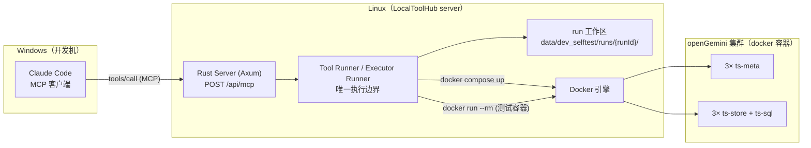

---

## 2. 前置准备

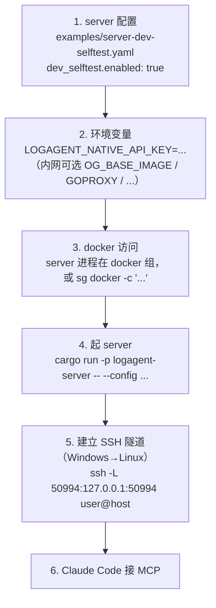

**server 启动**：

```bash
# Linux 上
export LOGAGENT_NATIVE_API_KEY=<your-key>
sg docker -c 'cargo run -p logagent-server -- --config examples/server-dev-selftest.yaml'
# 监听 127.0.0.1:50994（dev_selftest demo 配置）
```

**Claude Code 连接 MCP**（streamable-http，经 SSH 隧道）：

```bash
# Windows 上，先把远端口转到本地
ssh -L 50994:127.0.0.1:50994 user@linux-host -N
```

```json
// .mcp.json（或 Claude Code MCP 配置）
{
  "mcpServers": {
    "logagent": {
      "url": "http://127.0.0.1:50994/api/mcp",
      "headers": { "Authorization": "Bearer <your-key>" }
    }
  }
}
```

> 直连（不经隧道）需 TLS + API key + `mcp.allowed_origins`；localhost/隧道场景可留空。

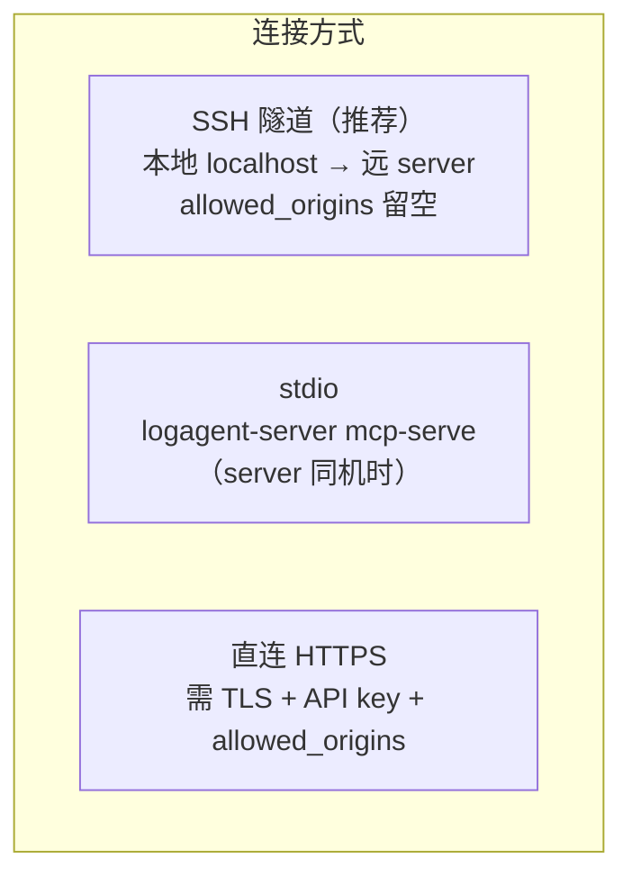

---

## 3. 五个工具 + run 模型

| 工具 | 关键参数 | 返回 |
|---|---|---|
| `logagent.dev_selftest.sync_workspace` | `label`，源三选一：`uploadId` / `gitRepo`+`gitRef` / 省略(空桩) | `{runId, status, sourceRef}` |
| `logagent.dev_selftest.build` | `{runId, buildProfile}` | `{status, exitCode, artifacts}` |
| `logagent.dev_selftest.deploy` | `{runId, profile}` | `{status, projectName, deployTarget}` |
| `logagent.dev_selftest.run_tests` | `{runId, testSuite}`（可选 `runMode`） | `{status, exitCode, executor, stdoutPath, stderrPath}` |
| `logagent.dev_selftest.report` | `{runId}` | `{status, reportPath, failedSteps, steps}` |
| `logagent.runs.get` | `{runId}`（platform 工具） | `{status, phase, resultAvailable}` |
| `logagent.runs.result` | `{runId}`（platform 工具） | 结构化结果 |

**关键约定**：`sync_workspace` 建 run 并返回 `runId`，**后续每次调用都带这个 `runId`**。MCP 参数可传
`{params:{...}}` 或顶层（`arguments` 即 `inputSchema`）；`runMode`/`uploadIds` 始终顶层。

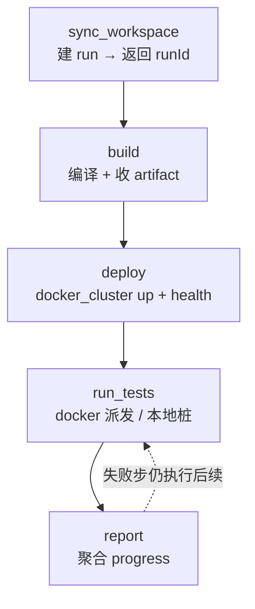

---

## 4. 端到端流水线

### 4.1 总览

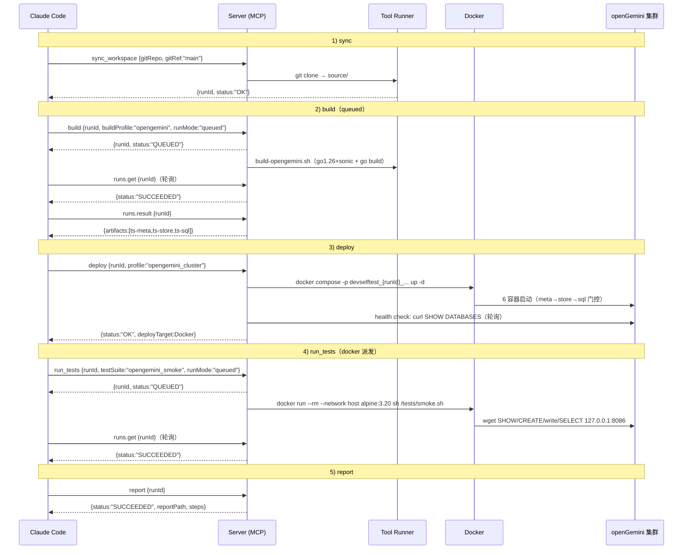

### 4.2 sync vs queued（runMode）

`tools/call` 接受可选 `runMode: "sync" | "queued"`（默认 `sync`）。短步骤同步；长步骤（build、run_tests）
用 `queued` 立即返回 `{runId, status:"QUEUED"}`，再用 platform 工具 `logagent.runs.get` 轮询，
`SUCCEEDED` 后 `logagent.runs.result` 取结构化结果。**一个 queued 调用一个 run，无子 run；runs.get/result
不建 ToolRun，不污染 run history。**

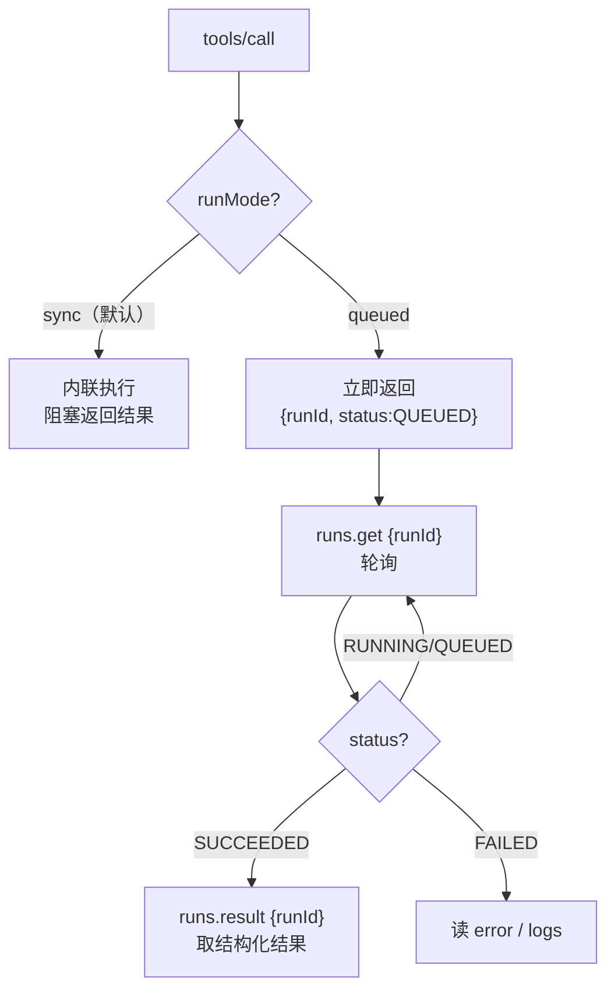

| 步骤 | 推荐 runMode |
|---|---|
| sync_workspace | sync |
| build | queued（编译慢） |
| deploy | sync（compose up 快；health 已轮询）或 queued |
| run_tests | queued（测试可能慢） |
| report | sync |

---

## 5. 各步骤详解

### 5.1 sync_workspace（源码同步）

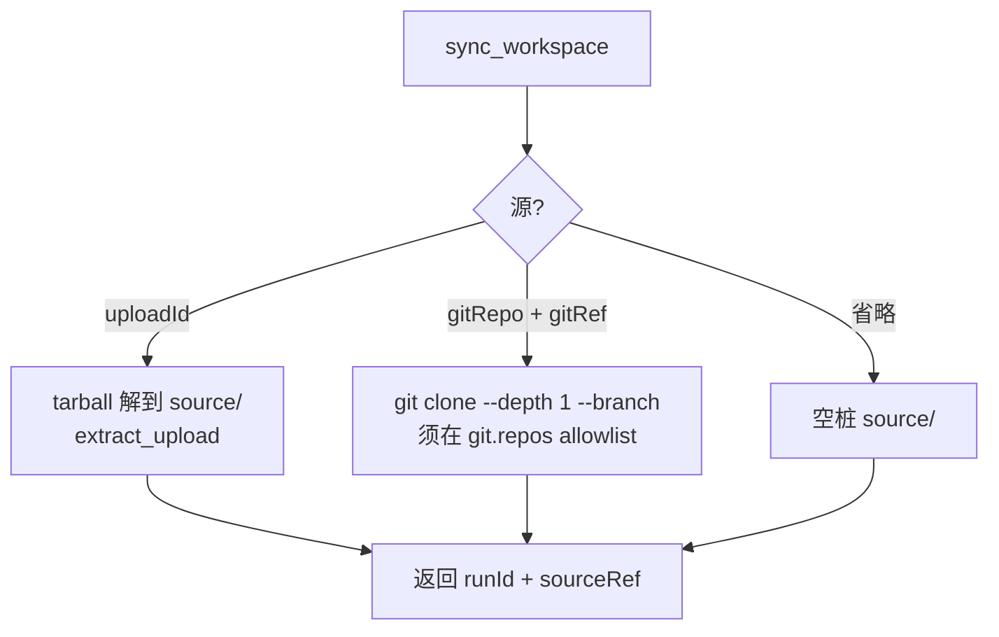

```
sync_workspace { label:"feat-x", gitRepo:"https://github.com/openGemini/openGemini.git", gitRef:"main" }
→ { runId:"devselftest_...", status:"OK", sourceRef:"git:...@main" }
```

### 5.2 build（真编译）

在 `source/{working_dir}` 跑配置式 `command`（首元素=二进制），`artifact_globs` 收集到 `artifacts/`，
写 `logs/build.{stdout,stderr}.txt`。openGemini demo 的 build 脚本先做 go1.26+sonic 兼容升级再 `go build`。

### 5.3 deploy — Path 1（docker 集群）

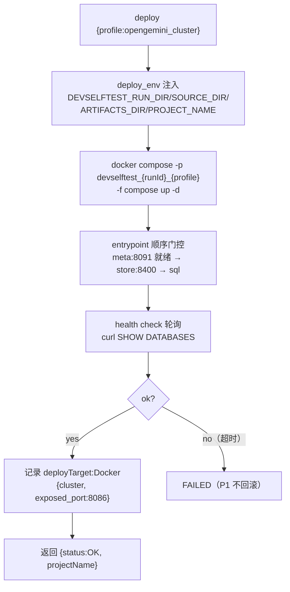

> 关键约束（openGemini）：容器需**静态 IP**（raft 用 `rpc-bind-address` 串作 Server ID，主机名会不选主）、
> `ubuntu:24.04`（22.04 libstdc++ 过旧）、顺序门控（`depends_on` 仅排序，entrypoint 须等就绪）。

### 5.4 run_tests（P2 双模式）

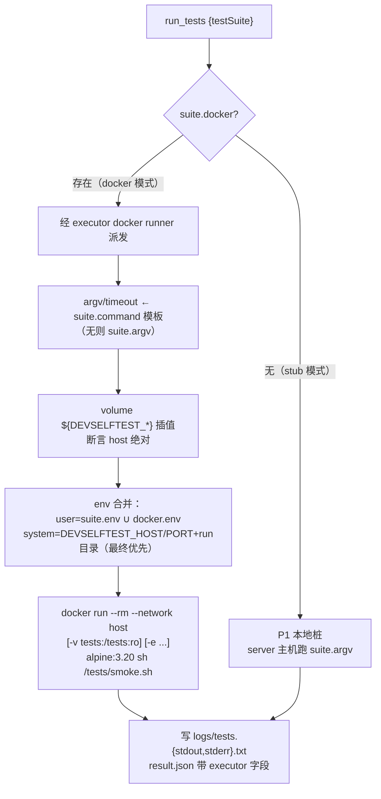

docker 模式下，测试容器用 `--network host` 经宿主暴露端口 `127.0.0.1:8086` 访问 ts-sql。系统 env
**最终优先**——用户 `env` 不能把测试悄悄打到错误目标。`smoke.sh` 默认用 busybox `wget`（alpine 预装），
无 apt/外网依赖；curl 优先。

### 5.5 executor runner（P2 抽通）

`run_executor_command` 支持 `ExecutorTarget::{Ssh, Docker}`，dev_selftest 复用 Docker 分支。SSH 分支
行为不变（保留 `TimedOut` 语义）。runner 不检查 `remote_execution.enabled`，故 SSH 关闭时仍可用 Docker 分支。

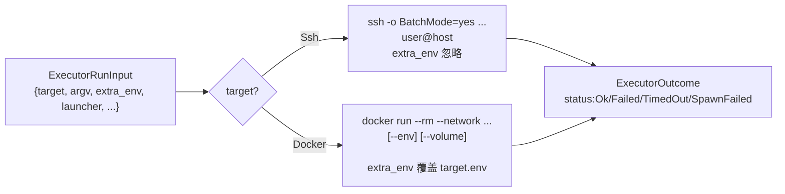

### 5.6 report

聚合 `progress.json` 步骤账本 + 证据 → `report.md`（表格：step/status/durationMs/error）+
`report.json`。总体 `SUCCEEDED`（无失败步）或 `FAILED`（含 `failedSteps`）。

---

## 6. Run 工作区与结果读取

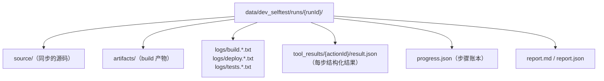

每次 `logagent.dev_selftest.*` 调用写一个 `result.json`（含 `status` OK/FAILED/SUCCEEDED、`runId`、
`durationMs`、`error`、步骤特定字段）。`logs/*.txt` 是原始 stdout/stderr。`report.md`/`report.json` 是
最终聚合。**artifact 路径对外是逻辑 ID，非原始本地路径**；下载带 `Authorization` 头。

---

## 7. 失败处理

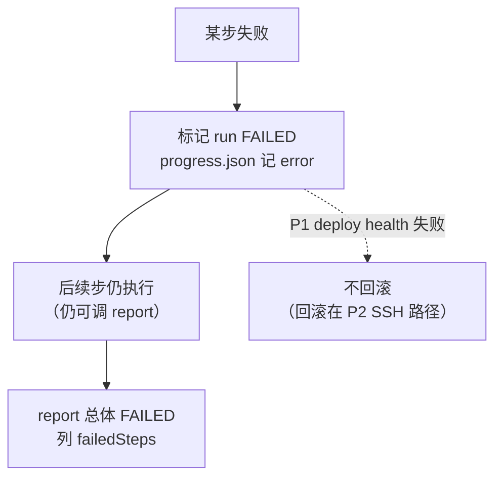

读失败原因：该步 `result.json` 的 `error` + `logs/*.stderr.txt`；`report.md` 的 `failedSteps`。

---

## 8. 三条部署路径

原始设计三条部署路径，当前仅 Path 1 实现：

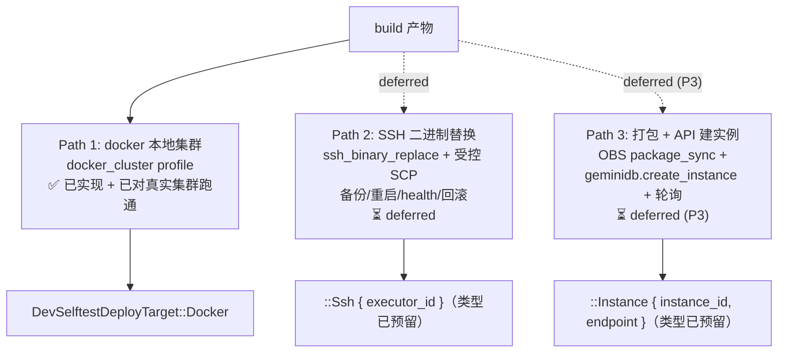

---

## 9. 配置与内网

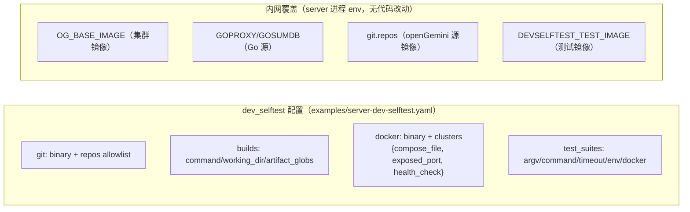

**安全校验**（`enabled:true` 时）：所有 build/docker/test 命令、`docker.binary`、`compose_file`、git 仓库+ref
必须绝对路径且 allowlist；tool 参数只选 profile id + `runId`，无自由 shell。`DevSelftestTestDocker` 校验：
image 不以 `-` 开头、network `host`|安全标识符、workdir 绝对无 `..`、volume
`host:absolute|${DEVSELFTEST_*}:container:absolute[:ro|rw]`、env 键 `^[A-Z_][A-Z0-9_]*$`。`command` 与非空
`argv` 互斥；`command` 须配 `docker` 块。

---

## 10. 完整 Claude Code 驱动示例

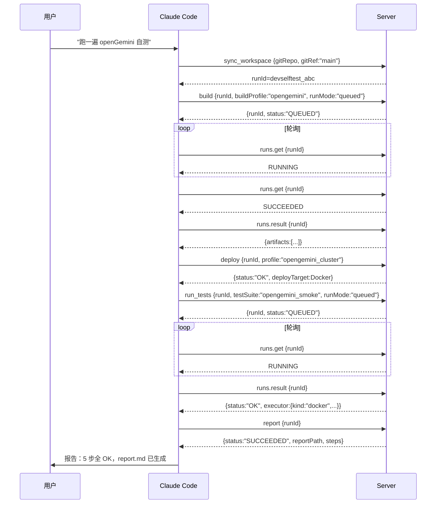

---

## 11. 清理

dev_selftest 无 `docker_down` 工具。多次 run 按 project name `devselftest_{runId}_{profile}` 隔离，
手动清理：

```bash
docker compose -p devselftest_<runId>_opengemini_cluster down
```

---

## 12. 状态总览

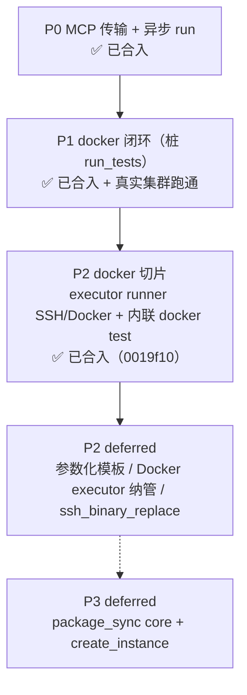

- ✅ Path 1（docker）：deploy + run_tests(docker) 已实现；P1 端到端已验证，P2 docker 派发经单测/集成测试验证（真实集群端到端待执行）。
- ⏳ Path 2（SSH 二进制替换）、Path 3（打包建实例）deferred。
- ⏳ 参数化 executor 命令模板（`{var}`+Schema）、Docker executor 纳管（record+CRUD+run history）、`docker_down` 工具、WebUI 视图、composite `run` 均 deferred。
